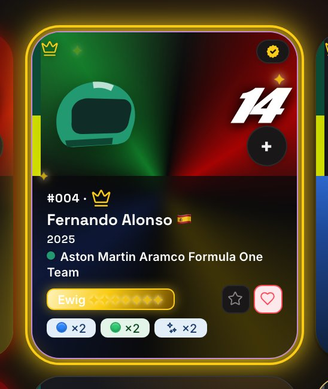
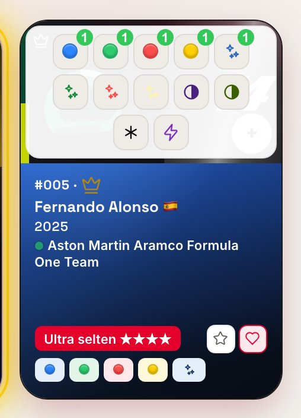
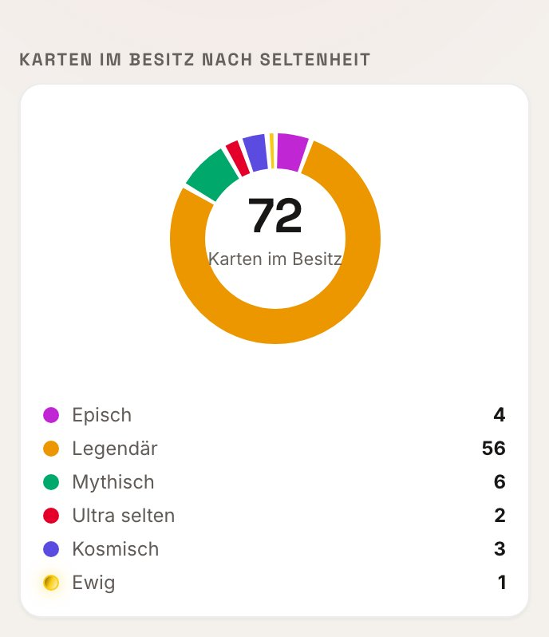
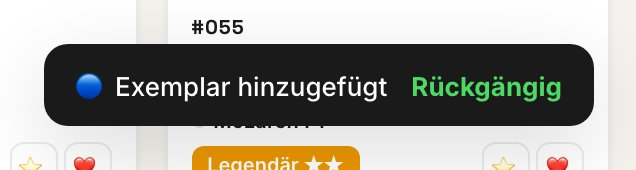
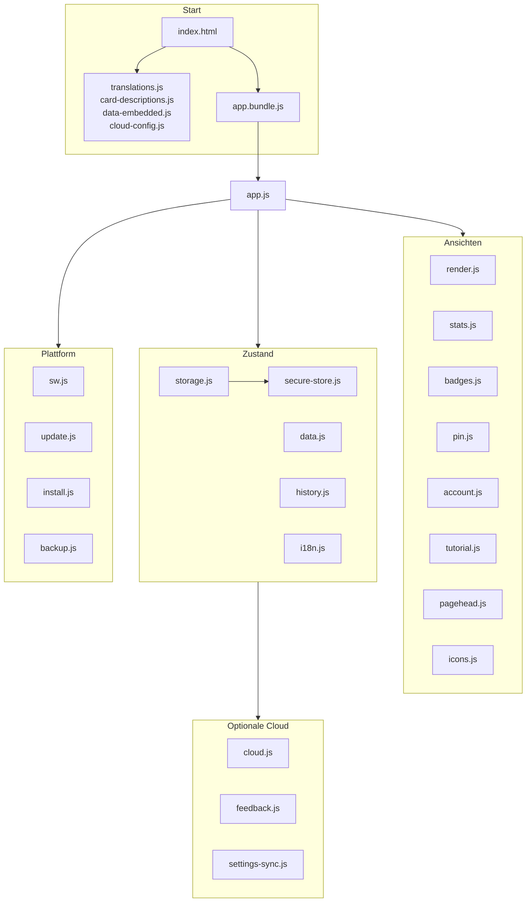

[🇬🇧 English](README.md) · [🇫🇷 Français](README.fr.md) · [🇪🇸 Español](README.es.md) · [🇨🇳 中文](README.zh.md) · [🇮🇹 Italiano](README.it.md) · [🇳🇱 Nederlands](README.nl.md) · 🇩🇪 **Deutsch**

# 🏎️ F1 UNO Élite — Collection Tracker

**Ein offline-first, installierbarer Sammelkarten-Tracker, gebaut mit Vanilla JavaScript und null Laufzeitabhängigkeiten — kein Framework, kein SDK, kein CDN, kein Backend.**

[| Führung — fünf Kapitel, eins pro Seite | Die fünf Foil-Familien, auf der beruhigten Stufe |
|---|---|
|  |  |

](https://github.com/Arts44/f1-uno-elite/actions/workflows/tests.yml)


## ▶️ **[Live ausprobieren → arts44.github.io/f1-uno-elite](https://arts44.github.io/f1-uno-elite/)**

Es ist eine **PWA**: aus dem Browser installiert läuft sie wie eine native App, vollständig offline, mit eigenem Icon — auf Desktop und Mobilgerät.


| Kartenansicht — animierte Foil-Typen | Statistik-Dashboard |
|---|---|
|  |  |

<sub>Weitere Aufnahmen in [`screenshots/`](screenshots/) — helles und dunkles Theme, Desktop und mobil.</sub>

### ✨ In Bewegung

| Schnelles Hinzufügen — ein Tipp, ein Exemplar | Navigation mit Perle | Abzeichen — 120, sieben Familien |
|---|---|---|
|  |  |  |


### Neu in 1.29 — der v2-Durchgang

| Abzeichen — Familien, Fortschritt, angepinntes Ziel | Abzeichen-Detail — Freischaltdatum, beitragende Karten |
|---|---|
|  |  |

| Konto — Cloud, Backups, Gefahrenzone | Einstellungen — die Sicherheitskarte |
|---|---|
|  |  |

| PIN-Entsperrung — segmentiert und maskiert | E-Mail-Code — dieselbe geteilte Komponente |
|---|---|
|  |  |

| Streckenverläufe — neu aus echten GPS-Daten gezeichnet | Abzeichen — helles Thema |
|---|---|
|  |  |


<sub>In 7 Sprachen lokalisiert — jeder Text, jedes Abzeichen, jeder Changelog-Eintrag</sub>

| Ewige Seltenheit — Champions mit komplettem Set | Schnell hinzufügen — Variantenauswahl |
|---|---|
|  |  |

| Seltenheits-Donut mit Ewig | Rückgängig-Hinweis |
|---|---|
|  |  |

---

## ✨ Was sie kann

Eine komplette **F1 UNO Élite**-Sammelkartensammlung verwalten — 101 Karten, jede in bis zu 16 Varianten (Grundfarben, Foils, Duals, Wild, Nitro, Promos):

- 📇 **Vollständige Sammlungsverwaltung** — im Besitz / Dubletten / Wunschliste / Favoriten, Stückzahlen pro Variante, die gesamte Sammlung immer im Blick.
- ➕ **Schnelles Hinzufügen mit einer Geste** — ein +-Button auf jeder Kachel öffnet eine Variantenauswahl: ein Tipp fügt ein Exemplar hinzu, mit „Rückgängig“-Toast. Der Header zeigt deinen Fortschritt live (besessen/gesamt) über einer feinen Fortschrittslinie.
- ✨ **Animiertes 7-stufiges Seltenheitssystem** — `epic → legendary → mythic → ultra → cosmic → divine → eternal`, berechnet aus der besten Variante im Besitz, +1 Stufe bei komplettem Set (jede Variante im Besitz) — `eternal` ist nur so erreichbar. Foil-Karten tragen bewegte Lichtreflexe, `divine` erscheint als irisierender Verlauf und `eternal` in funkelndem Schwarz-Gold (alles unter Beachtung von `prefers-reduced-motion`).
- 📴 **Funktioniert komplett offline** — die gesamte App wird von einem Service Worker vorgecacht; nach dem ersten Besuch ändert der Flugmodus nichts.
- 🔄 **Transparente Auto-Updates** — neue Versionen werden im Hintergrund erkannt und mit einem Tipp übernommen, dazu ein integriertes Changelog, das zeigt, was sich seit *deiner* letzten Version geändert hat.
- 🌍 **7 Sprachen** — Englisch, Französisch, Spanisch, Chinesisch, Italienisch, Niederländisch, Deutsch. Jeder Text, jedes Abzeichen, jeder Changelog-Eintrag.
- 🎓 **Interaktives Tutorial, 28 Schritte in 5 Kapiteln** — ein Kapitel pro Seite, in der Reihenfolge der Tabs. Eine Führung, in der du die *echten* Aktionen ausführst, in einer Sandbox, die am Ende jede Änderung zurücknimmt.
- 🏅 **Eine Abzeichen-Seite, die deine Sammlung erzählt** — 120 Abzeichen in 7 Familien: Werdegang, komplette Sets, Foils, Farben, Leidenschaft und selbst bestätigte Erlebnisse. Ein Fortschrittsring mit deinem Titel, eine *Nächstes Abzeichen*-Karte, die immer das nächstliegende zeigt — oder das Ziel, das du angepinnt hast —, eine Meilenstein-Leiter von 1 bis 101 Karten, Freischaltdaten und eine echte Feier, wenn eines fällt: gebündelter Hinweis, kurze Vibration und ein Aufplatzen der Kachel. Deine Sammlerkarte lässt sich als teilbares Bild exportieren.
- 📊 **Statistik-Dashboard** — Gesamtfortschritt, Seltenheits-Donut, Vollständigkeit je Kategorie, Höhepunkte, eine Tag-für-Tag-Fortschrittskurve (reines SVG, keine Diagrammbibliothek) und die Sammlerwerkzeuge als innere Tabs: Fehl-, Dubletten- und Tauschlisten.
- 👤 **Eine eigene Konto-Seite** — Cloud-Anmeldung per E-Mail-Code, Sichern/Wiederherstellen, JSON-Export/-Import, QR-Übertragung, Feedback in der App und eine Gefahrenzone mit drei Löschbereichen, jeder durch ein einzutippendes Wort geschützt. Im Zuschauermodus wird die ganze Seite durch einen gesperrten Zustand ersetzt — die Bedienelemente fehlen, sie sind nicht ausgegraut.
- 🔁 **Backups überall** — JSON-Export/-Import, ein komprimierter Backup-Code von Gerät zu Gerät, derselbe Code als scanbarer QR-Code, und optionales Cloud-Backup.
- 🔐 **PIN-Sperre, Zuschauermodus & optionale Verschlüsselung** — eine 4-stellige PIN auf einem Segmentfeld (jede Ziffer kurz sichtbar, dann maskiert), geführte Abläufe zum Anlegen/Ändern/Deaktivieren mit sichtbarem Fortschritt, ein Nur-Lese-Modus zum Teilen und optionale Verschlüsselung der Sammlung im Ruhezustand (PBKDF2 + AES-GCM, aus der PIN abgeleitet).
- 🧭 **Eine Navigationsleiste mit Bead** — Pille, Kerbe und Bead sind ein einziger SVG-Pfad, der Bild für Bild aus einer einzigen Animationsuhr neu berechnet wird, sodass beide nie auseinanderlaufen. Ziehbar, per Tastatur erreichbar und `prefers-reduced-motion` wird respektiert.

---

## 🛠️ Tech-Stack

| Bereich | Wahl |
|---|---|
| Sprache | **Vanilla JavaScript** (native ES-Module), HTML5, CSS3 — kein Framework |
| Laufzeitabhängigkeiten | **Null.** Keine npm-Pakete, kein CDN, kein SDK zur Laufzeit |
| Build | [esbuild](https://esbuild.github.io/) (die *einzige* devDependency) → ein minifiziertes IIFE-Bundle |
| Offline / PWA | Handgeschriebener Service Worker (versionierter Precache, Cache-first-Shell) + Web App Manifest |
| Cloud (optional) | **Supabase über rohes REST-`fetch()`** — ohne SDK; E-Mail-OTP-Anmeldung, Row Level Security |
| Krypto | Natives **Web Crypto** — SHA-256 (PIN), PBKDF2 + AES-GCM (optionale Verschlüsselung im Ruhezustand) |
| QR-Codes | Einbezogener Ein-Datei-Encoder ([Project Nayuki](https://www.nayuki.io/page/qr-code-generator-library), MIT) |
| Schriften | Selbst gehostete WOFF2 (SIL OFL) — keine Google-Fonts-Anfrage, 5 Themes zur Auswahl |
| Tests | **Nodes eingebauter Test-Runner** (`node --test`) — 470 Tests, kein Test-Framework |
| CI | GitHub Actions — Tests + Build + Aktualitätsprüfung des committeten Bundles bei jedem Push/PR |

**Null Laufzeitabhängigkeiten ist eine Designregel, kein Zufall.** Alles, was ein Framework oder SDK üblicherweise liefert — Rendering, Navigation zwischen Ansichten, i18n, Offline-Caching, Auth über REST, Verschlüsselung, QR-Erzeugung — ist direkt auf den Webplattform-APIs umgesetzt. Die App, die du installierst, ist exakt der Code in diesem Repository.

---

## 🧱 Die Architektur in Kürze

Der Quellcode besteht aus fokussierten **ES-Modulen** hinter einem einzigen Einstiegspunkt, `app.js`, von esbuild zu einem committeten `app.bundle.js` gebündelt (GitHub Pages führt keinen Build-Schritt aus). Zwei HTML-Einstiegspunkte teilen sich alles Übrige: `index-dev.html` lädt die rohen Module für die Entwicklung, `index.html` lädt das Bundle.

| Schicht | Module |
|---|---|
| Zustand & Daten | `storage.js` (localStorage, saisonbezogen, Migration v1→v2), `data.js`, `history.js` |
| Oberfläche | `render.js` (Raster, Filter, Kartenansicht), `stats.js`, `badges.js`, `pin.js` (Einstellungen) |
| Plattform | `sw.js` (Precache), `update.js` (Updates), `install.js`, `secure-store.js` |
| Optionale Cloud | `cloud.js`, `feedback.js`, `settings-sync.js` — alle über rohes REST |

Aktionen laufen über **einen einzigen delegierten Listener** auf `[data-action]` statt über Inline-Handler — was auch den Betrachtermodus möglich macht, da ein einziges `VIEWER_BLOCKED`-Set jeden Schreibzugriff sperrt. Oberflächentext steht nie im Code: er läuft über `t()` gegen Wörterbücher, die alle 7 Sprachen abdecken.

### Die Form des Projekts

Vier klassische Skripte veröffentlichen `window.__*`-Globals vor den Modulen; alles andere ist ein ES-Modul hinter einem einzigen Einstiegspunkt.




---

## 🧗 Technische Herausforderungen

Die Probleme, die diesen Code wirklich geprägt haben:

### Offline-first *und* immer aktuell
Ein Cache-first-Service-Worker macht die App offline unerschütterlich — und hervorragend darin, endlos veralteten Code auszuliefern. Installierte PWAs trifft es am härtesten: Sie können tagelang ohne Navigation offen bleiben, der Browser prüft den Worker also nie erneut.
**Lösung:** Der neue Worker lädt im Hintergrund und parkt bewusst im *waiting*-Zustand (kein automatisches `skipWaiting` — die Shell unter einer laufenden App auszutauschen ist der sichere Weg, ihren Zustand zu zerstören). Ein Banner befördert ihn mit einem Tipp per `SKIP_WAITING`; ein ignoriertes Banner löst sich beim nächsten Kaltstart von selbst. Installierte PWAs rufen zusätzlich bei jeder Rückkehr in den Vordergrund und stündlich `registration.update()` auf. Die App-Version leitet sich aus dem neuesten Changelog-Eintrag ab: Veröffentlichen *heißt* Changelog schreiben.

### Eine E-Mail-Anmeldung, die eine installierte PWA übersteht
Die klassische Magic-Link-Anmeldung bricht in installierten PWAs: Der Link öffnet sich im Standardbrowser — einer anderen Speicherpartition — und die Sitzung landet dort, wo die App nicht ist.
**Lösung:** Die Authentifizierung nutzt **E-Mail-OTP-Codes** als Hauptweg, direkt in der App eingetippt, sodass die Sitzung jedes Mal im richtigen Kontext entsteht. Der gesamte GoTrue-Ablauf ist mit rohem `fetch()` umgesetzt.

### Ein Service Worker, der die API nie anfasst
Ein vorcachender Service Worker, der alles abfängt, liefert bereitwillig eine API-Antwort aus dem Cache — ein stiller Datenkorruptions-Bug, der erst in Produktion auftaucht.
**Lösung:** Der Worker schließt die Supabase-Origin vollständig aus, und Cloud-Aufrufe senden zusätzlich `cache: 'no-store'`.

### Ein CSS-Refactoring, Byte für Byte als identisch bewiesen
Hunderte hartkodierte Abstandswerte auf Tokens migrieren, mit „sieht für mich gleich aus" als einziger Garantie.
**Lösung:** Ausschließlich exakt passende Ersetzungen, danach ein Beweis — jedes `var()` in Vorher- und Nachher-Stylesheet zu Pixelwerten auflösen und beide Byte für Byte vergleichen. Ein späterer Durchgang benannte die wiederkehrenden Halbschritte, statt 61 Deklarationen allein der Skalenreinheit wegen zu runden.

### Feedback mit E-Mail-Benachrichtigung — ohne Server
**Lösung:** Ein Postgres-Trigger auf der `feedback`-Tabelle ruft über `pg_net` die Resend-API auf — vollständig innerhalb von Supabase. Der API-Schlüssel liegt verschlüsselt im Vault, Nutzerinhalte werden HTML-escaped, und eine fehlschlagende E-Mail kann den Insert nie blockieren.

### Eine Browser-App ohne Browser testen
Das Null-Abhängigkeiten-Versprechen schließt Jest, Vitest und Headless-Browser-Gespanne aus.
**Lösung:** Die Logik wurde browserfrei faktorisiert und wird von **470 Tests auf Nodes eingebautem Runner** abgedeckt — keine Testabhängigkeiten, kein echtes Netzwerk. Die CI baut zudem das Bundle neu und schlägt fehl, wenn das committete Artefakt veraltet ist.

---

### Was die Tests abdecken — und was nicht

470 Tests auf Nodes eingebautem Runner, ohne Framework. Genauigkeit über die Grenze zählt mehr als die Zahl:

- **Abgedeckt:** Speichermigrationen und das saisonbezogene Schlüsselschema; die siebenstufige Seltenheitsleiter samt Aufstieg durch ein vollständiges Set; alle Abzeichenbedingungen und das Schwierigkeitsmodell; die Sammlerlisten (fehlend, doppelt, Tausch); die Kodierungsdurchläufe der Sicherungscodes; die Cloud-Helfer gegen ein nachgebildetes `fetch` samt Fehlerpfaden; die Gleichheit der i18n-Schlüssel über 7 Sprachen und das Erkennen doppelter Schlüssel; der Precache des Service Workers gegen den echten Importgraphen; die Markup-Verträge des Tastaturzugangs; die Herkunft jedes von außen gespeisten `innerHTML`; WCAG-AA-Kontrast in beiden Themen.
- **Nicht abgedeckt:** das tatsächliche Rendern (keine DOM-Zusicherungen über Markup-Strings hinaus), das Laufzeitverhalten des Service Workers, echte Netzwerkaufrufe, IndexedDB, Installationsaufforderungen und alles, was eine Browser-Engine braucht — das wird von Hand und durch den deterministischen Screenshot-Durchlauf geprüft, nicht durch die Suite. Der Abdeckungsprozentsatz wird bewusst nicht veröffentlicht: Er würde die browserfreie Schicht messen und sich lesen, als messe er die App.

## 🚀 Loslegen

Ein moderner Browser und ein beliebiger statischer HTTP-Server (`file://` genügt nicht — ES-Module und das `fetch()` der JSON-Dateien werden dort blockiert).

```bash
# Entwicklung — kein Build-Schritt, rohe ES-Module:
python3 -m http.server 8000
# → http://localhost:8000/index-dev.html

# Produktions-Bundle:
npm install     # installiert esbuild, die einzige devDependency
npm run build   # app.js → app.bundle.js (minifiziert + Sourcemap)
# → http://localhost:8000/  (index.html)

npm test        # 470 Tests, node --test, ohne Framework
```

**Deployment.** Das Repository wird unverändert auf GitHub Pages deployt: Alle URLs sind relativ, die App läuft also identisch auf einer Domain-Root, unter einem Unterpfad und auf localhost. Release-Routine: einen Changelog-Eintrag hinzufügen (das *ist* der Versionssprung) → `SW_VERSION` erhöhen → bauen → pushen.

---

## ⚖️ Ehrliche Grenzen

- **Die PIN ist eine Oberflächenbarriere, keine starke Sicherheit.** Ohne die optionale Verschlüsselung ist die Sammlung per DevTools im `localStorage` lesbar. Mit aktiver Verschlüsselung ist beiläufiges Schnüffeln blockiert — aber eine 4-stellige PIN lässt sich offline brute-forcen, wenn jemand das Gerät in Händen hält. Eine vergessene PIN macht eine verschlüsselte lokale Sammlung unwiederbringlich.
- **Die Cloud-Anmeldung stützt sich auf die eigene Supabase-E-Mail-Konfiguration des Projekts.** Zustellung, Kontingente und Absenderreputation werden serverseitig geregelt und von diesem Repository nicht gemessen — betrachte Anmelde-E-Mails als «nach bestem Bemühen» für ein persönliches Projekt, nicht als garantierte Zustellung.
- **Die Fortschrittshistorie kennt kein Back-fill** — die Statistikkurve beginnt an dem Tag, an dem das Feature installiert wurde.

---

## 🔩 Engineering-Notizen

Null Laufzeitabhängigkeiten (nur esbuild, beim Build); null Layoutverschiebung, pixelgenau zwischen Versionen gemessen; das schnelle Hinzufügen profiliert und optimiert (~300 ms → ~45 ms auf einem Mittelklasse-Handy); optionale lokale Verschlüsselung am PIN (PBKDF2 + AES-GCM); Zuschauermodus in der Logik verriegelt, nicht im CSS; Screenshots von einem deterministischen Skript im Repo regeneriert; 470 Tests in Vanilla-JS mit Nodes eingebautem Runner. Alle Details im [englischen README](README.md).

---

## 📜 Lizenz & Marken

Veröffentlicht unter der **MIT-Lizenz** — siehe [LICENSE](LICENSE). © 2026 Arthur — [@Arts44](https://github.com/Arts44).

> **Inoffizielles Fanprojekt, nicht kommerziell.** „F1" und „UNO" sowie die Logos und Bilder von Teams und Fahrern gehören ihren jeweiligen Eigentümern. Dieses Werkzeug steht in keiner Verbindung zu Formula 1, Mattel oder einem Team und wird von ihnen weder unterstützt noch gesponsert.
