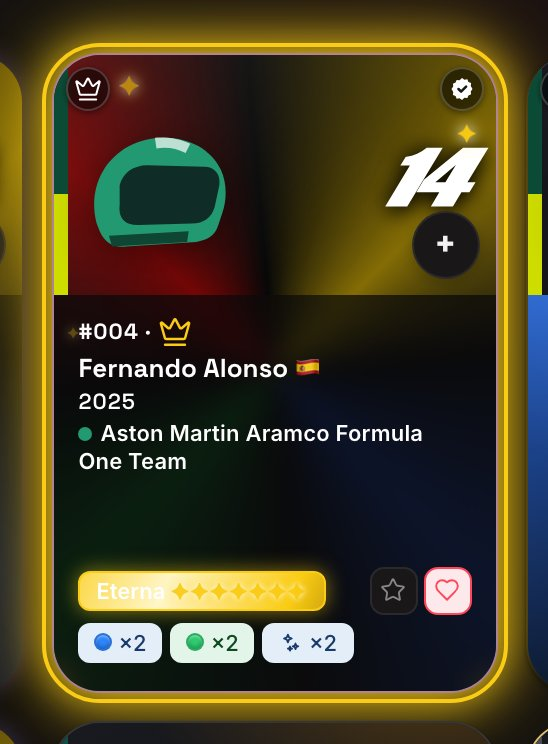
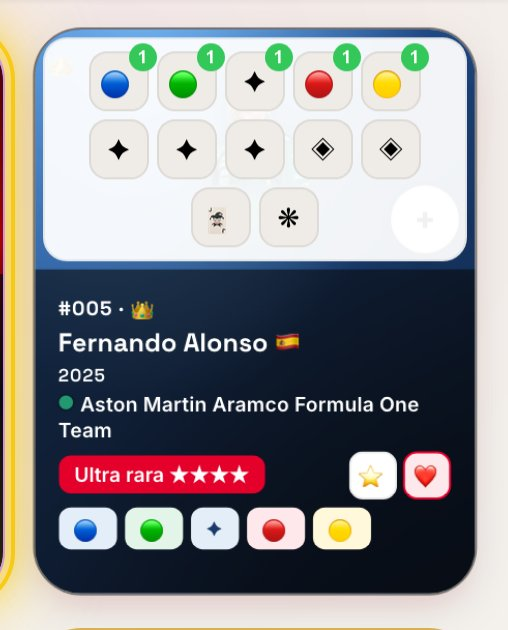
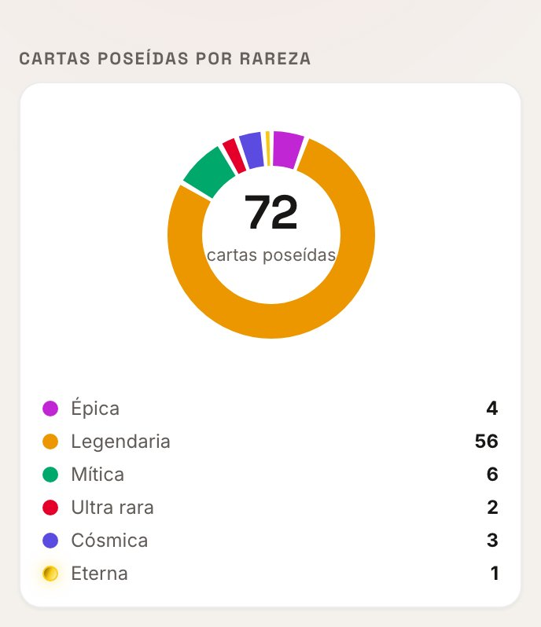
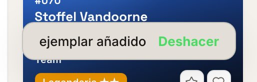
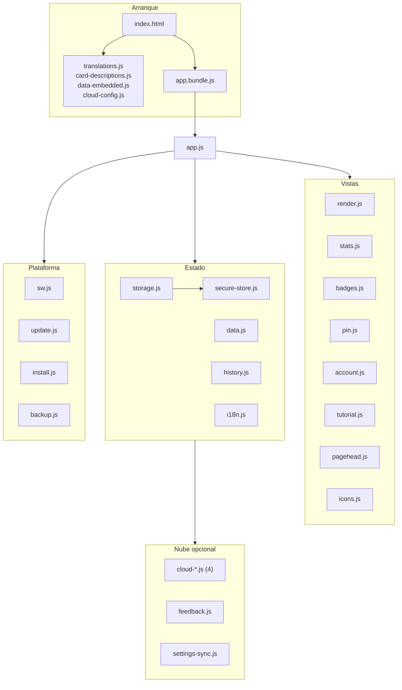

[🇬🇧 English](README.md) · [🇫🇷 Français](README.fr.md) · 🇪🇸 **Español** · [🇨🇳 中文](README.zh.md) · [🇮🇹 Italiano](README.it.md) · [🇳🇱 Nederlands](README.nl.md) · [🇩🇪 Deutsch](README.de.md)

# 🏎️ F1 UNO Élite — Collection Tracker

**Un gestor de colección de cartas instalable y offline-first, construido con JavaScript vanilla y cero dependencias en tiempo de ejecución — sin framework, sin SDK, sin CDN, sin backend.**

[](https://github.com/Arts44/f1-uno-elite/actions/workflows/tests.yml)


[](https://app.codacy.com/gh/Arts44/f1-uno-elite/dashboard)

## ▶️ **[Pruébala en vivo → arts44.dev](https://arts44.dev/)**

Es una **PWA**: instálala desde tu navegador y funciona como una app nativa, totalmente sin conexión, con su propio icono — en escritorio y en móvil.


| Ficha de carta — tipos foil animados | Panel de estadísticas |
|---|---|
|  |  |

<sub>Más capturas en [`screenshots/`](screenshots/) — temas claro y oscuro, escritorio y móvil.</sub>

### ✨ En movimiento

| Añadido rápido — un toque, un ejemplar | Navegación con píldora | Insignias — 120, siete familias | Dos temporadas, a un toque |
|---|---|---|---|
|  |  |  |  |

Cada demo la genera `capture_demos.py` con el mismo seed determinista que las capturas fijas, **sin ninguna diferencia visible entre ejecuciones**: cada animación se congela en una fase elegida antes de cada disparo. El umbral está cifrado y se verifica con un comando (`compare_captures.py`); el byte exacto no es alcanzable — queda un ruido de antialiasing de unas decenas de píxeles a 10 niveles sobre 255. Los GIF van a 33,3 fps; la versión a 60 fps está al lado: [añadido rápido](screenshots/demo-quick-add.mp4) · [navegación](screenshots/demo-nav.mp4) · [insignias](screenshots/demo-badges.mp4) · [temporadas](screenshots/demo-seasons.mp4).


### Novedades 1.29 — la pasada v2

| Insignias — familias, progreso, objetivo fijado | Detalle de insignia — fecha de desbloqueo, cartas contributivas |
|---|---|
|  |  |

| Cuenta — nube, copias, zona de peligro | Ajustes — la tarjeta de seguridad |
|---|---|
|  |  |

| Desbloqueo con PIN — segmentado y enmascarado | Código por correo — el mismo componente compartido |
|---|---|
|  |  |

| Trazados de circuitos — rehechos desde datos GPS reales | Insignias — tema claro |
|---|---|
|  |  |

| Visita guiada — cinco capítulos, uno por página | Las cinco familias de foil, en el nivel atenuado |
|---|---|
|  |  |


<sub>Localizado en 7 idiomas — cada texto, insignia y entrada del registro</sub>

| Rareza Eterna — campeones con set completo | Añadido rápido — selector de variantes |
|---|---|
|  |  |

| Donut de rarezas con Eterna | Aviso Deshacer |
|---|---|
|  |  |

---

## ✨ Qué hace

Seguir una colección completa de cartas **F1 UNO Élite** — 101 cartas de la temporada 2025, cada una en hasta 16 variantes (colores base, foils, duales, Wild, Nitro, promos):

- 📇 **Gestión completa de la colección** — en propiedad / repetidas / wishlist / favoritas, cantidades por variante, toda la colección siempre a la vista.
- ➕ **Añadido rápido con un gesto** — un botón + en cada casilla abre un selector de variantes: un toque añade un ejemplar, con aviso «Deshacer». La cabecera de la página Colección muestra tu progreso en vivo: una barra más poseídas / que faltan / repetidas.
- ✨ **Sistema de rareza animado de 7 niveles** — `epic → legendary → mythic → ultra → cosmic → divine → eternal`, calculado a partir de la mejor variante en propiedad, +1 nivel cuando la serie está completa (todas las variantes en propiedad) — `eternal` solo se alcanza así. Las cartas foil llevan barridos de luz animados, `divine` se muestra como un degradado iridiscente y `eternal` en negro y oro centelleante (todo respetando `prefers-reduced-motion`).
- 📴 **Funciona totalmente sin conexión** — toda la app queda precacheada por un service worker; tras la primera visita, el modo avión no cambia nada.
- 🔄 **Actualizaciones transparentes** — las nuevas versiones se detectan en segundo plano y se aplican con un toque, con un changelog integrado que muestra qué ha cambiado desde *tu* última versión.
- 🌍 **7 idiomas** — inglés, francés, español, chino, italiano, neerlandés, alemán. Cada texto, insignia y entrada del changelog.
- 🎓 **Tutorial interactivo, 33 pasos en 5 capítulos** — un capítulo por página, en el orden de las pestañas. Una visita guiada donde *realizas* las acciones reales, en un entorno aislado que revierte todos los cambios al terminar.
- 🏅 **Una página de insignias que cuenta tu colección** — 120 insignias en 7 familias: trayectoria, sets completos, foils, colores, pasión y experiencias vividas que validas tú mismo. Un anillo de progreso con tu título, una tarjeta *Próxima insignia* que destaca siempre la más cercana — o el objetivo que fijaste —, una escalera de hitos de 1 a 101 cartas, las fechas de desbloqueo y una celebración de verdad cuando cae una: aviso agrupado, vibración breve y estallido en la ficha. Tu tarjeta de coleccionista se exporta como imagen para compartir.
- 📊 **Panel de estadísticas** — progreso global, donut de rarezas, completitud por categoría, momentos destacados, una curva de progreso día a día (SVG puro, sin librería de gráficos) y las herramientas de coleccionista como pestañas internas: listas de faltantes, repetidas e intercambios.
- 👤 **Una página Cuenta dedicada** — inicio de sesión en la nube por código de correo, copia/restauración, exportación/importación JSON, transferencia por QR, opiniones integradas y una zona de peligro con tres alcances de borrado, cada uno protegido por una palabra que hay que escribir. En modo espectador toda la página se sustituye por un estado bloqueado: los controles están ausentes, no desactivados.
- 🔁 **Copias de seguridad por todas partes** — exportación/importación JSON, un código de respaldo comprimido de dispositivo a dispositivo, el mismo código como QR escaneable, y copia en la nube opcional.
- 🔐 **Bloqueo con PIN, modo espectador y cifrado opcional** — un PIN de 4 dígitos en un teclado segmentado (cada dígito visible un instante y luego enmascarado), recorridos guiados para crearlo/cambiarlo/desactivarlo con progreso visible, un modo de solo lectura para compartir y cifrado en reposo opcional de la colección (PBKDF2 + AES-GCM, derivado del PIN).
- 🧭 **Una barra de navegación con pastilla** — la píldora, su muesca y la pastilla son un único trazado SVG recalculado fotograma a fotograma desde un solo reloj de animación, así que nunca se desincronizan. Arrastrable, accesible por teclado y respeta `prefers-reduced-motion`.

---

## 🛠️ Stack técnico

| Área | Elección |
|---|---|
| Lenguaje | **JavaScript vanilla** (módulos ES nativos), HTML5, CSS3 — sin framework |
| Dependencias en runtime | **Cero.** Sin paquetes npm, sin CDN, sin SDK en ejecución |
| Build | [esbuild](https://esbuild.github.io/) (la *única* devDependency) → un bundle IIFE minificado |
| Offline / PWA | Service Worker escrito a mano (precache versionado, shell cache-first) + Web App Manifest |
| Nube (opcional) | **Supabase por `fetch()` REST puro** — sin SDK; auth por código OTP por e-mail, Row Level Security |
| Cripto | **Web Crypto** nativo — SHA-256 (PIN), PBKDF2 + AES-GCM (cifrado en reposo opcional) |
| Códigos QR | Codificador de un solo archivo vendorizado ([Project Nayuki](https://www.nayuki.io/page/qr-code-generator-library), MIT) |
| Fuentes | WOFF2 autoalojadas (SIL OFL) — ninguna petición a Google Fonts, 5 temas a elegir |
| Tests | **Runner de tests integrado en Node** (`node --test`) — 955 tests, sin framework de test |
| CI | GitHub Actions — tests + build + verificación de frescura del bundle commiteado en cada push/PR |

**Cero dependencias en runtime es una regla de diseño, no una casualidad.** Todo lo que un framework o SDK proporcionaría — renderizado, navegación entre vistas, i18n, caché offline, auth por REST, cifrado, generación de QR — está construido directamente sobre las API de la plataforma web. La app que instalas es exactamente el código de este repositorio. Desde entonces: `cloud.js` (726 líneas) se dividió en cuatro módulos tras 61 tests de caracterización nunca modificados, lo que desbloqueó `pushSeason(s)` / `listCloudSeasons()` — verificados contra la base real de Supabase; y se cerraron dos agujeros XSS en el origen, en `tEsc()` y en los puntos de entrada de datos.

---

## 🧱 La arquitectura en breve

El código es un conjunto de **módulos ES** enfocados tras un único punto de entrada, `app.js`, empaquetados por esbuild en un `app.bundle.js` commiteado (GitHub Pages no ejecuta ningún paso de build). Dos puntos de entrada HTML comparten todo lo demás: `index-dev.html` carga los módulos en crudo para desarrollo, `index.html` carga el bundle.

| Capa | Módulos |
|---|---|
| Estado y datos | `storage.js` (localStorage, por temporada, migración v1→v2), `data.js`, `history.js` |
| Interfaz | `render.js` (cuadrícula, filtros, ficha de carta), `stats.js`, `badges.js`, `pin.js` (ajustes) |
| Plataforma | `sw.js` (precache), `update.js` (actualizaciones), `install.js`, `secure-store.js` |
| Nube opcional | `cloud-http/auth/sync/ui.js`, `feedback.js`, `settings-sync.js` — todos en REST puro |

Las acciones pasan por **un único listener delegado** sobre `[data-action]` en lugar de manejadores en línea — que es también lo que hace posible el modo lector, ya que un solo conjunto `VIEWER_BLOCKED` bloquea toda escritura. El texto de interfaz nunca aparece en el código: pasa por `t()` sobre diccionarios que cubren los 7 idiomas.

### La forma del proyecto

Cuatro scripts clásicos publican globales `window.__*` antes que los módulos; todo lo demás es un módulo ES tras un único punto de entrada.




---

## 🧗 Retos técnicos

Los problemas que realmente moldearon este código:

### Offline-first *y* siempre al día
Un service worker cache-first hace la app indestructible sin conexión — y excelente sirviendo código obsoleto indefinidamente. Las PWA instaladas son las más afectadas: pueden quedar abiertas días sin una navegación, así que el navegador nunca vuelve a comprobar el worker.
**Solución:** el nuevo worker se descarga en segundo plano y se aparca deliberadamente en estado *waiting* (sin `skipWaiting` automático — cambiar el shell bajo una app en marcha es la receta para corromper el estado). Un banner lo promociona con un toque mediante `SKIP_WAITING`; un banner ignorado se resuelve en el siguiente arranque en frío. Las PWA instaladas llaman además a `registration.update()` al volver al primer plano y cada hora. La versión de la app deriva de la entrada más reciente del changelog: publicar *es* escribir el changelog.

### Inicio de sesión por e-mail que sobrevive a una PWA instalada
El magic link clásico se rompe en una PWA instalada: el enlace se abre en el navegador por defecto — una partición de almacenamiento distinta — y la sesión aterriza donde la app no está.
**Solución:** la autenticación usa **códigos OTP por e-mail** como vía principal, tecleados en la propia app, así que la sesión se crea siempre en el contexto correcto. Todo el flujo GoTrue está implementado con `fetch()` puro.

### Un service worker que nunca toca la API
Un service worker de precache que intercepta todo servirá encantado una respuesta de API desde la caché — un bug silencioso de corrupción de datos que solo aparece en producción.
**Solución:** el worker excluye por completo el origen de Supabase, y las llamadas a la nube envían además `cache: 'no-store'`.

### Un refactor de CSS probado idéntico, byte a byte
Migrar cientos de valores de espaciado escritos a mano hacia tokens, con «a mí me parece igual» como única garantía.
**Solución:** sustitución solo por coincidencia exacta, y después una prueba — resolver cada `var()` de ambas hojas de estilo a píxeles y compararlas byte a byte. Una pasada posterior nombró los medios pasos recurrentes en vez de redondear 61 declaraciones solo por pureza de escala.

### Feedback con notificación por e-mail — sin servidor
**Solución:** un trigger de Postgres sobre la tabla `feedback` llama a la API de Resend mediante `pg_net`, todo dentro de Supabase. La clave de API vive cifrada en el Vault, el contenido del usuario se escapa como HTML desde SQL, y el trigger se traga sus propios fallos (`exception when others`): un e-mail fallido jamás puede bloquear la inserción. Un **segundo trigger aplica el límite real de frecuencia en la base de datos** — cinco opiniones por usuario y hora, lanzadas como `rate_limited` — y la app traduce ese error a un código tipado. La espera del lado cliente es una cortesía; la protección está en el servidor.

### Probar una app de navegador sin navegador
Mantener la promesa de cero dependencias descarta Jest, Vitest y los arneses de navegador headless.
**Solución:** la lógica se factorizó para ser independiente del navegador y está cubierta por **955 tests en el runner integrado de Node** — sin dependencias de test, sin red real. La CI también reconstruye el bundle y falla si el artefacto commiteado está obsoleto.

---

### Qué cubren las pruebas — y qué no

955 pruebas sobre el ejecutor integrado de Node, sin framework. Ser preciso sobre el límite importa más que el número:

- **Cubierto:** migraciones de almacenamiento y esquema de claves por temporada; la escala de rareza de siete niveles, incluido el ascenso por set completo; todas las condiciones de insignia y el modelo de dificultad; las listas del coleccionista (que faltan, repetidas, intercambio); los ciclos de codificación de los códigos de copia; los ayudantes de nube contra un `fetch` simulado, incluidos los caminos de fallo; la paridad de claves i18n en los 7 idiomas y la detección de duplicados; la precaché del service worker frente al grafo real de importaciones; los contratos de marcado del acceso por teclado; la procedencia de cada `innerHTML` alimentado desde fuera; el contraste verificado a mano en ambos temas.
- **No cubierto:** el renderizado real (ninguna aserción DOM más allá de cadenas de marcado), el comportamiento del service worker en ejecución, llamadas de red reales, IndexedDB, los avisos de instalación, y todo lo que exija un motor de navegador — eso se verifica a mano y con la pasada determinista de capturas, no con la suite. El porcentaje citado más arriba mide solo esta parte sin navegador — léelo como tal, no como una medida de la aplicación.

## 🚀 Primeros pasos

Un navegador moderno y cualquier servidor HTTP estático (`file://` no sirve — los módulos ES y el `fetch()` de los JSON quedan bloqueados ahí).

```bash
# Desarrollo — sin build, módulos ES en crudo:
python3 -m http.server 8000
# → http://localhost:8000/index-dev.html

# Bundle de producción:
npm install     # instala esbuild, la única devDependency
npm run build   # app.js → app.bundle.js (minificado + sourcemap)
# → http://localhost:8000/  (index.html)

npm test        # 955 tests, node --test, sin framework
```

**Despliegue.** El repositorio se despliega tal cual en GitHub Pages: todas las URL son relativas, así que la app funciona igual en la raíz de un dominio, bajo un subdirectorio y en localhost. Rutina de release: añadir una entrada al changelog (eso *es* el bump de versión) → subir `SW_VERSION` → build → push.

---

## ⚖️ Límites asumidos

- **El PIN es una barrera de interfaz, no seguridad fuerte.** Sin el cifrado opcional, la colección es legible en `localStorage` desde las DevTools. Con el cifrado activo, la curiosidad casual queda bloqueada — pero un PIN de 4 dígitos puede forzarse offline si alguien tiene el dispositivo. Un PIN olvidado hace irrecuperable una colección local cifrada.
- **Los códigos de acceso y las notificaciones de opinión salen ya de un dominio verificado** (`noreply@arts44.dev` — SPF, DKIM, MX y DMARC en su sitio desde el 13/08/2026). Un dominio nuevo no tiene reputación de envío, y las primeras medidas lo dicen sin rodeos: en la primera hora, un mensaje a Proximus fue **rechazado** (`554 … poor reputation of a domain used in message transfer`, marcado transitorio) y un mensaje a Gmail **llegó a la carpeta de spam**. Es el comportamiento esperado de un dominio sin historial — mejora con el volumen — pero mientras se gana la reputación, puede haber que rescatar el código del correo no deseado, o que algún proveedor lo rechace. Un envío fallido sigue sin bloquear nada: la opinión se guarda en la base de datos en cualquier caso.
- **Los códigos de acceso viajan por un proveedor SMTP configurado en Supabase** — una cadena totalmente distinta de las notificaciones anteriores. La entrega, las cuotas y la reputación del remitente dependen de ese proveedor y este repositorio no las mide; considera los correos de acceso como «en la medida de lo posible» para un proyecto personal.
- **El historial de progresión no tiene relleno retroactivo** — la curva de estadísticas empieza el día en que se instaló la función.
- **La nota de Codacy es A — y uno de sus cuatro objetivos de calidad está en rojo.** Medido en el commit `b680aed`, 123 archivos, 9 643 líneas. En verde: la duplicación al 5 % (objetivo 10 %) y la cobertura al 69 % — la medición de Codacy y la local (`npm run test:cov`, 69,21 %) coinciden esta vez, frente a un objetivo del 60 %: nueve puntos de margen en lugar de 2,7. En rojo: la complejidad, con **el 45 % de los archivos analizados por encima del umbral** frente a un objetivo del 10 % — el ratio *subió* tras dividir `cloud.js` en cuatro, lo que dice mucho de la métrica: cuenta *archivos*, así que penaliza una base hecha de pocos módulos grandes. Es un hecho sobre la medición, no una excusa; `badges.js` hace realmente demasiado. Y una cuarta cifra que el distintivo oculta: **2 issues abiertas**, frente a 11 — las 8 de los scripts de captura y las 2 variables sin usar de `account.js` se corrigieron, no se silenciaron (`c5941cd`). Las dos supervivientes son **la misma regla disparándose sobre una cadena que no es un secreto**: un token falso en `capture_seed.py` (`demo.access.token`, herramienta de desarrollo que nunca se publica) y `SESSION_KEY = 'f1uno_cloud_session'` en `cloud-auth.js`, que es el *nombre* de una clave de localStorage. Se dejan visibles a propósito: un falso positivo que permanece en el panel cuesta una línea de explicación, mientras que desactivar la regla ocultaría también el verdadero positivo que está para detectar.

---

## 🔩 Notas de ingeniería

Cero dependencias en ejecución (solo esbuild, al compilar); suelo tipográfico de 11 px verificado en 5 tipografías × 2 temas × 320/375/escritorio (una sola excepción, el « ÉLITE » del logotipo a 8 px, que es marca); desplazamiento de diseño medido, y ahora realmente nulo: la altura de baldosa es FIJA (antes 13 alturas distintas, de 246,69 a 292,69 px), el esqueleto lee la misma variable CSS y encaja exactamente — a costa de un +19,4 % de desplazamiento, el precio de reservar el peor caso en todas partes; el añadido rápido perfilado y optimizado (~300 ms → ~45 ms en un móvil medio, medición única no repetida en CI); cifrado local opcional ligado al PIN (PBKDF2 + AES-GCM); modo espectador bloqueado en la lógica, no en CSS; capturas regeneradas por un script determinista versionado, las cuatro demos animadas guionizadas y reproducibles; 955 tests en JS vanilla con el runner integrado de Node. Detalles completos en el [README inglés](README.md).

---

## ☕ Apoyar al desarrollador

Un único enlace saliente, en **Ajustes → Acerca de**, lleva a [Ko-fi](https://ko-fi.com/arts44). Apoya **a mí, el desarrollador** — no a la app ni a su universo. Ningún script de terceros, ningún píxel de seguimiento, ningún dato personal sale del dispositivo: es un `<a target="_blank" rel="noopener noreferrer">` y nada más. La URL vive en una constante única (`SUPPORT_URL` en `pin.js`); vaciarla hace desaparecer la fila. Sin conexión, la fila queda visiblemente inerte en vez de llevar a una página muerta.

**Nada se desbloquea al donar** — ninguna función, ninguna insignia, ningún nombre en una lista. Una donación que comprara algo sería una compra, y este proyecto sigue siendo un proyecto de fan no comercial.

---

## 📜 Licencia y marcas

Publicado bajo **licencia MIT** — ver [LICENSE](LICENSE). © 2026 Arthur — [@Arts44](https://github.com/Arts44).

> **Proyecto de fan no oficial, sin ánimo de lucro.** «F1» y «UNO», junto con los logotipos e imágenes de equipos y pilotos, pertenecen a sus respectivos propietarios. Esta herramienta no está afiliada, respaldada ni patrocinada por la Formula 1, Mattel ni ningún equipo.
