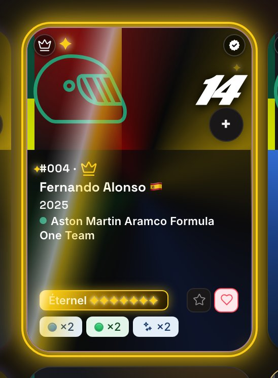
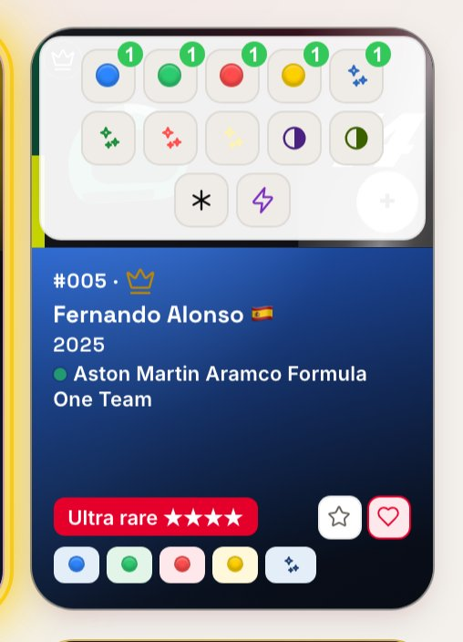
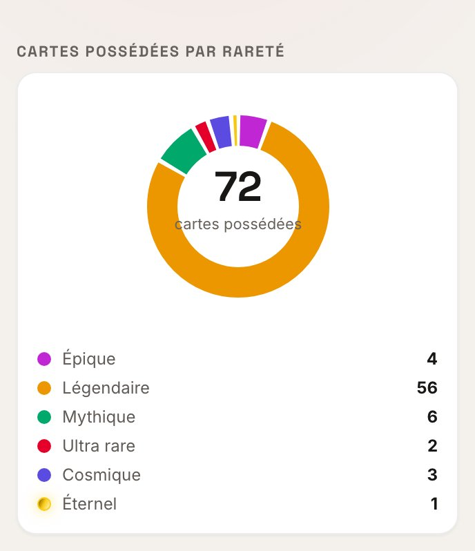
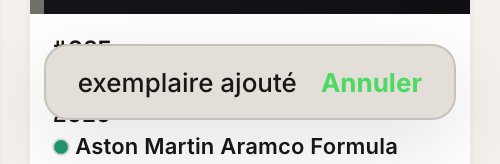
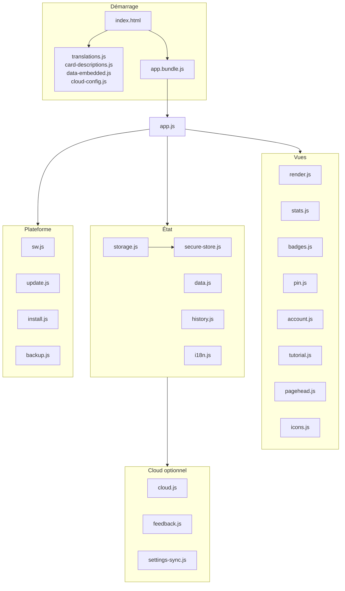

[🇬🇧 English](README.md) · 🇫🇷 **Français** · [🇪🇸 Español](README.es.md) · [🇨🇳 中文](README.zh.md) · [🇮🇹 Italiano](README.it.md) · [🇳🇱 Nederlands](README.nl.md) · [🇩🇪 Deutsch](README.de.md)

# 🏎️ F1 UNO Élite — Collection Tracker

**Un tracker de collection de cartes, installable et pensé hors-ligne d'abord, écrit en JavaScript vanilla avec zéro dépendance à l'exécution — pas de framework, pas de SDK, pas de CDN, pas de backend.**

[| Visite guidée — cinq chapitres, un par page | Les cinq familles de foil, au niveau atténué |
|---|---|
|  |  |

](https://github.com/Arts44/f1-uno-elite/actions/workflows/tests.yml)


## ▶️ **[Essayer en ligne → arts44.github.io/f1-uno-elite](https://arts44.github.io/f1-uno-elite/)**

C'est une **PWA** : installez-la depuis votre navigateur et elle fonctionne comme une app native, entièrement hors-ligne, avec sa propre icône — sur ordinateur comme sur mobile.


| Fiche carte — types foil animés | Tableau de bord Stats |
|---|---|
|  |  |

<sub>Plus de captures dans [`screenshots/`](screenshots/) — thèmes clair et sombre, ordinateur et mobile.</sub>

### ✨ En mouvement

| Ajout rapide — un geste, un exemplaire | Navigation à pastille | Badges — 120, sept familles |
|---|---|---|
|  |  |  |


### Nouveautés 1.29 — la passe v2

| Badges — familles, progression, objectif épinglé | Détail d’un badge — date de déblocage, cartes contributives |
|---|---|
|  |  |

| Compte — cloud, sauvegardes, zone danger | Réglages — la carte sécurité |
|---|---|
|  |  |

| Déverrouillage PIN — segmenté et masqué | Code e-mail — le même composant partagé |
|---|---|
|  |  |

| Tracés de circuits — refaits depuis des relevés GPS réels | Badges — thème clair |
|---|---|
|  |  |


<sub>Localisé en 7 langues — chaque texte, badge et entrée de changelog</sub>

| Rareté Éternel — champions en set complet | Ajout rapide — sélecteur de variantes |
|---|---|
|  |  |

| Donut des raretés avec Éternel | Toast Annuler |
|---|---|
|  |  |

---

## ✨ Ce que ça fait

Suivre une collection complète de cartes **F1 UNO Élite** — 101 cartes, chacune existant en jusqu'à 16 variantes (couleurs de base, foils, duals, Wild, Nitro, promos) :

- 📇 **Gestion complète de la collection** — possédées / doubles / wishlist / favoris, quantités par variante, l’ensemble de la collection toujours visible.
- ➕ **Ajout rapide en un geste** — un bouton + sur chaque tuile ouvre un sélecteur de variantes : un appui ajoute un exemplaire, avec un toast « Annuler ». Le bandeau de la page Collection affiche la progression en direct : une barre, puis possédées / manquantes / doubles.
- ✨ **Système de rareté animé à 7 niveaux** — `epic → legendary → mythic → ultra → cosmic → divine → eternal`, calculé depuis la meilleure variante possédée, +1 niveau quand le set est complet (toutes les variantes possédées) — `eternal` n'est atteignable que comme ça. Les cartes foil portent des reflets de lumière animés, `divine` s'affiche en dégradé irisé mouvant et `eternal` en noir & or scintillant (le tout respectant `prefers-reduced-motion`).
- 📴 **Fonctionne entièrement hors-ligne** — toute l'app est précachée par un service worker ; après la première visite, le mode avion ne change rien.
- 🔄 **Mises à jour transparentes** — les nouvelles versions sont détectées en arrière-plan et appliquées d'un tap, avec un changelog intégré qui montre ce qui a changé depuis *votre* dernière version.
- 🌍 **7 langues** — anglais, français, espagnol, chinois, italien, néerlandais, allemand. Chaque texte, badge et entrée de changelog.
- 🎓 **Tutoriel interactif, 28 étapes en 5 chapitres** — un chapitre par page, dans l’ordre des onglets. Une visite guidée où vous *réalisez* les vraies actions, dans un bac à sable qui annule chaque modification à la fin.
- 🏅 **Une page Badges qui raconte votre collection** — 120 badges en 7 familles : parcours, sets complets, écuries, foils, couleurs, passion, et expériences vécues que vous validez vous-même. Chaque badge porte un **score de difficulté intrinsèque** (0–100) calculé depuis l'effort d'acquisition qu'il exige — pas depuis une télémétrie, que cette app ne collecte pas. Un anneau de progression avec votre titre, une carte *Prochain badge* qui met toujours en avant le plus proche — ou l'objectif que vous avez épinglé —, une échelle de jalons de 1 à 101 cartes, les dates de déblocage, et une vraie célébration quand l'un tombe : toast groupé, courte vibration, et explosion sur la tuile. Votre carte de collectionneur s'exporte en image partageable.
- 📊 **Tableau de bord Stats** — progression globale, donut des raretés, complétion par catégorie, temps forts, une courbe de progression jour par jour (SVG pur, aucune bibliothèque de graphiques), et les outils de collectionneur en onglets internes : listes manquantes, doubles et échanges.
- 👤 **Une page Compte dédiée** — connexion cloud par code e-mail, sauvegarde/restauration, export/import JSON, transfert par QR, avis intégré, et une zone danger offrant trois portées de suppression, chacune protégée par un mot à retaper. En mode spectateur, toute la page est remplacée par un état verrouillé — les contrôles sont absents, pas grisés.
- 🔁 **Sauvegardes partout** — export/import JSON, un code de sauvegarde compressé d'appareil à appareil, le même code en QR scannable, et une sauvegarde cloud optionnelle.
- 🔐 **Verrou PIN, mode spectateur & chiffrement optionnel** — un PIN à 4 chiffres sur un pavé segmenté (chaque chiffre visible un instant, puis masqué), des parcours guidés pour le créer/changer/désactiver avec progression visible, un mode lecture seule pour partager, et un chiffrement au repos opt-in de la collection (PBKDF2 + AES-GCM, dérivé du PIN).
- 🧭 **Une barre de navigation à pastille** — la pilule, son encoche et la pastille forment un seul chemin SVG recalculé image par image depuis une horloge unique, si bien que les deux ne dérivent jamais. Glissable, accessible au clavier, et respectant `prefers-reduced-motion`.

---

## 🛠️ Stack technique

| Domaine | Choix |
|---|---|
| Langage | **JavaScript vanilla** (modules ES natifs), HTML5, CSS3 — aucun framework |
| Dépendances à l'exécution | **Zéro.** Pas de paquet npm, pas de CDN, pas de SDK au runtime |
| Build | [esbuild](https://esbuild.github.io/) (l'*unique* devDependency) → un bundle IIFE minifié |
| Hors-ligne / PWA | Service Worker écrit à la main (précache versionné, shell cache-first) + Web App Manifest |
| Cloud (optionnel) | **Supabase en `fetch()` REST brut** — sans SDK ; auth par code OTP e-mail, Row Level Security |
| Crypto | **Web Crypto** natif — SHA-256 (PIN), PBKDF2 + AES-GCM (chiffrement au repos optionnel) |
| Codes QR | Encodeur mono-fichier vendorisé ([Project Nayuki](https://www.nayuki.io/page/qr-code-generator-library), MIT) |
| Polices | WOFF2 auto-hébergées (SIL OFL) — aucune requête Google Fonts, 5 thèmes au choix |
| Tests | **Runner de test intégré à Node** (`node --test`) — 470 tests, aucun framework de test |
| CI | GitHub Actions — tests + build + vérification de fraîcheur du bundle commité à chaque push/PR |

**Zéro dépendance à l'exécution est une règle de conception, pas un hasard.** Tout ce qu'un framework ou un SDK fournirait — rendu, navigation entre vues, i18n, cache hors-ligne, auth REST, chiffrement, génération de QR — est construit directement sur les API de la plateforme web. L'app que vous installez est exactement le code de ce dépôt.

---

## 🧱 L'architecture en bref

Le code est un ensemble de **modules ES** ciblés derrière un point d'entrée unique, `app.js`, assemblés par esbuild en un `app.bundle.js` commité (GitHub Pages n'exécute aucune étape de build). Deux points d'entrée HTML partagent tout le reste : `index-dev.html` charge les modules bruts pour le développement, `index.html` charge le bundle.

| Couche | Modules |
|---|---|
| État & données | `storage.js` (localStorage, scoppé par saison, migration v1→v2), `data.js`, `history.js` |
| Interface | `render.js` (grille, filtres, fiche carte), `stats.js`, `badges.js`, `pin.js` (réglages) |
| Plateforme | `sw.js` (précache), `update.js` (mises à jour), `install.js`, `secure-store.js` |
| Cloud optionnel | `cloud.js`, `feedback.js`, `settings-sync.js` — tous en REST brut |

Les actions passent par **un unique écouteur délégué** sur `[data-action]` plutôt que par des gestionnaires en ligne — c'est aussi ce qui rend possible le mode lecteur, puisqu'un seul ensemble `VIEWER_BLOCKED` verrouille toutes les écritures. Le texte d'interface n'apparaît jamais dans le code : il passe par `t()` sur des dictionnaires couvrant les 7 langues.

### La forme du projet

Quatre scripts classiques publient des globales `window.__*` avant les modules ; tout le reste est un module ES derrière un point d'entrée unique.




---

## 🧗 Défis techniques

Les problèmes qui ont réellement façonné ce code :

### Hors-ligne d'abord *et* toujours à jour
Un service worker cache-first rend l'app inébranlable hors-ligne — et excellente pour servir du code périmé indéfiniment. Les PWA installées sont les plus touchées : elles peuvent rester ouvertes des jours sans navigation, le navigateur ne revérifie donc jamais le worker.
**Solution :** le nouveau worker se télécharge en arrière-plan et se gare délibérément en état *waiting* (pas de `skipWaiting` automatique — remplacer le shell sous une app en cours d'exécution, c'est ainsi qu'on corrompt l'état). Un bandeau le promeut en un tap via `SKIP_WAITING` ; un bandeau ignoré se résout au prochain démarrage à froid. Les PWA installées appellent en plus `registration.update()` à chaque retour au premier plan et toutes les heures. La version de l'app dérive de l'entrée de changelog la plus récente : publier, *c'est* écrire le changelog.

### Une connexion e-mail qui survit à une PWA installée
Le magic link classique casse dans une PWA installée : le lien s'ouvre dans le navigateur par défaut — une partition de stockage différente — et la session atterrit là où l'app n'est pas.
**Solution :** l'authentification passe en priorité par des **codes OTP e-mail**, saisis dans l'app elle-même, donc la session naît au bon endroit à chaque fois. Tout le flux GoTrue est implémenté en `fetch()` brut.

### Un service worker qui ne touche jamais l'API
Un service worker de précache qui intercepte tout servira volontiers une réponse d'API depuis le cache — un bug de corruption de données silencieux qui n'apparaît qu'en production.
**Solution :** le worker exclut entièrement l'origine Supabase, et les appels cloud envoient aussi `cache: 'no-store'`.

### Un refactor CSS prouvé identique, octet par octet
Migrer des centaines de valeurs d'espacement en dur vers des tokens, avec pour seule garantie « ça a l'air pareil ».
**Solution :** substitution en correspondance exacte uniquement, puis une preuve — résoudre chaque `var()` des deux feuilles de style en pixels et les comparer octet par octet. Une passe ultérieure a nommé les demi-pas récurrents plutôt que d'arrondir 61 déclarations pour la seule pureté de l'échelle.

### Du feedback avec notification e-mail — sans serveur
**Solution :** un trigger Postgres sur la table `feedback` appelle l'API Resend via `pg_net`, entièrement dans Supabase. La clé d'API vit chiffrée dans le Vault, le contenu utilisateur est échappé en HTML, et un e-mail en échec ne peut jamais bloquer l'insertion.

### Tester une app navigateur sans navigateur
Tenir la promesse zéro dépendance exclut Jest, Vitest et les harnais de navigateur headless.
**Solution :** la logique a été factorisée pour être indépendante du navigateur et couverte par **470 tests sur le runner intégré de Node** — aucune dépendance de test, aucun réseau réel. La CI reconstruit aussi le bundle et échoue si l'artefact commité est périmé.

---

### Ce que les tests couvrent — et ce qu'ils ne couvrent pas

470 tests sur le lanceur intégré de Node, sans framework. Être précis sur la frontière compte plus que le nombre :

- **Couvert :** migrations de stockage et schéma de clés par saison ; l'échelle de rareté à sept niveaux, bonus de set complet inclus ; toutes les conditions de badge et le modèle de difficulté ; les listes du collectionneur (manquantes, doubles, échange) ; les allers-retours d'encodage des codes de sauvegarde ; les aides cloud contre un `fetch` simulé, chemins d'échec compris ; la parité des clés i18n sur les 7 langues et la détection de doublons ; le precache du service worker confronté au vrai graphe d'imports ; les contrats de markup de l'accès clavier ; la provenance de chaque `innerHTML` nourri de l'extérieur ; le contraste WCAG AA sur les deux thèmes.
- **Non couvert :** le rendu réel (aucune assertion DOM au-delà des chaînes de markup), le comportement du service worker à l'exécution, les appels réseau réels, IndexedDB, les invites d'installation, et tout ce qui exige un moteur de navigateur — ces points sont vérifiés à la main et par la passe de captures déterministe, pas par la suite. Le pourcentage de couverture n'est volontairement pas publié : il mesurerait la tranche sans navigateur et se lirait comme s'il mesurait l'application.

## 🚀 Démarrer

Un navigateur moderne et n'importe quel serveur HTTP statique (`file://` ne suffit pas — modules ES et `fetch()` des JSON y sont bloqués).

```bash
# Développement — sans build, modules ES bruts :
python3 -m http.server 8000
# → http://localhost:8000/index-dev.html

# Bundle de production :
npm install     # installe esbuild, l'unique devDependency
npm run build   # app.js → app.bundle.js (minifié + sourcemap)
# → http://localhost:8000/  (index.html)

npm test        # 470 tests, node --test, sans framework
```

**Déploiement.** Le dépôt se déploie tel quel sur GitHub Pages : toutes les URL sont relatives, l'app tourne donc à l'identique à la racine d'un domaine, sous un sous-chemin et en localhost. Routine de release : ajouter une entrée de changelog (c'*est* le bump de version) → incrémenter `SW_VERSION` → build → push.

---

## ⚖️ Limites assumées

- **Le PIN est une barrière d'interface, pas une sécurité forte.** Sans le chiffrement optionnel, la collection est lisible dans `localStorage` via les DevTools. Chiffrement activé, la curiosité ordinaire est bloquée — mais un PIN à 4 chiffres se brute-force hors-ligne pour qui tient l'appareil. Un PIN oublié rend une collection locale chiffrée irrécupérable.
- **La connexion cloud repose sur la configuration e-mail Supabase du projet.** Délivrabilité, quotas et réputation d'expéditeur se règlent côté serveur et ne sont pas mesurés par ce dépôt — les e-mails de connexion sont à considérer comme « au mieux » pour un projet perso, pas comme une livraison garantie.
- **L'historique de progression n'a pas de rétro-remplissage** — la courbe des stats commence le jour où la fonctionnalité a été installée.

---

## 🔩 Notes d'ingénierie

Zéro dépendance à l'exécution (esbuild seul, au build) ; zéro décalage de mise en page, mesuré au pixel entre les versions ; l'ajout rapide profilé et optimisé (~300 ms → ~45 ms sur mobile moyen) ; chiffrement local optionnel lié au PIN (PBKDF2 + AES-GCM) ; mode spectateur verrouillé dans la logique, pas en CSS ; captures régénérées par un script déterministe versionné ; 470 tests en JS vanilla avec le runner intégré de Node. Détails complets dans le [README anglais](README.md).

---

## 📜 Licence & marques

Publié sous **licence MIT** — voir [LICENSE](LICENSE). © 2026 Arthur — [@Arts44](https://github.com/Arts44).

> **Projet fan non officiel, non commercial.** « F1 » et « UNO », ainsi que les logos et images des équipes et pilotes, appartiennent à leurs propriétaires respectifs. Cet outil n'est ni affilié, ni approuvé, ni sponsorisé par la Formula 1, Mattel ou aucune équipe.
