[🇬🇧 English](README.md) · [🇫🇷 Français](README.fr.md) · [🇪🇸 Español](README.es.md) · [🇨🇳 中文](README.zh.md) · 🇮🇹 **Italiano** · [🇳🇱 Nederlands](README.nl.md) · [🇩🇪 Deutsch](README.de.md)

# 🏎️ F1 UNO Élite — Collection Tracker

**Un tracker per collezioni di carte, installabile e offline-first, costruito in JavaScript vanilla con zero dipendenze a runtime — niente framework, niente SDK, niente CDN, nessun backend.**

[| Visita guidata — cinque capitoli, uno per pagina | Le cinque famiglie di foil, al livello attenuato |
|---|---|
| 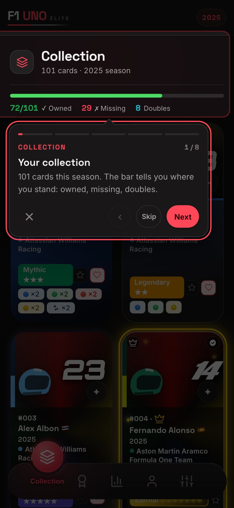 | 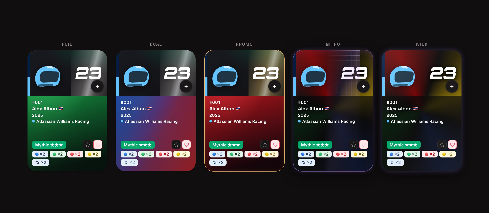 |

[](https://github.com/Arts44/f1-uno-elite/actions/workflows/tests.yml)


[](https://app.codacy.com/gh/Arts44/f1-uno-elite/dashboard)

## ▶️ **[Provala dal vivo → arts44.github.io/f1-uno-elite](https://arts44.github.io/f1-uno-elite/)**

È una **PWA**: installala dal browser e funziona come un'app nativa, completamente offline, con la propria icona — su desktop e mobile.

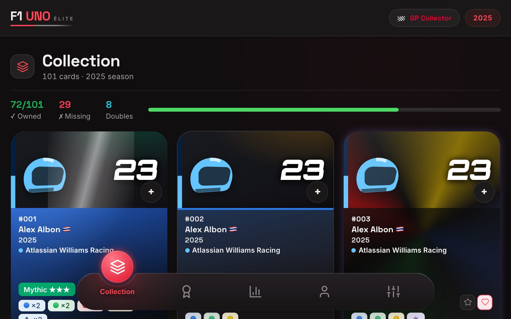

| Scheda carta — tipi foil animati | Dashboard delle statistiche |
|---|---|
| 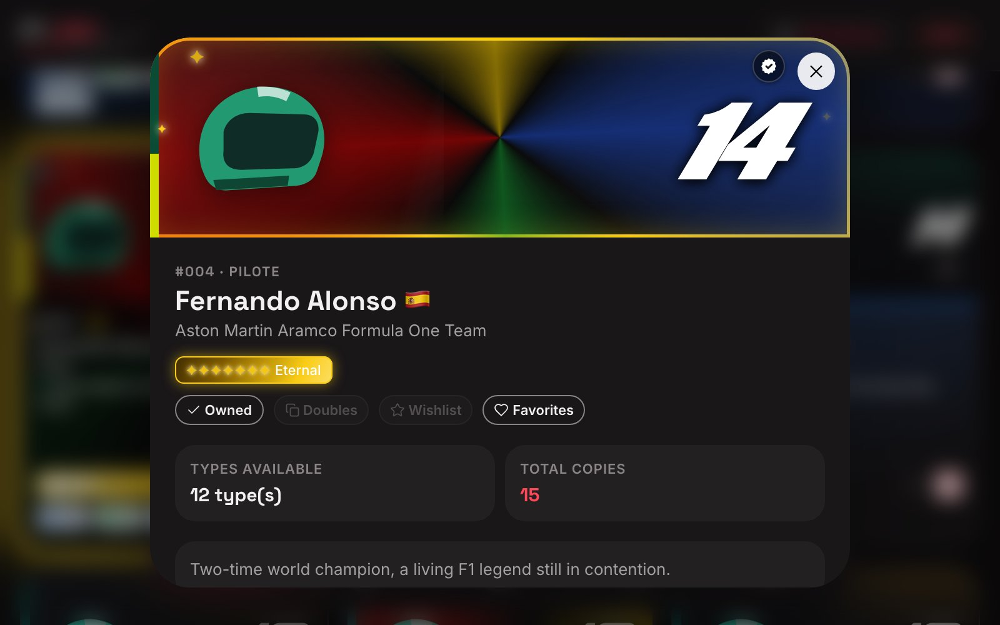 | 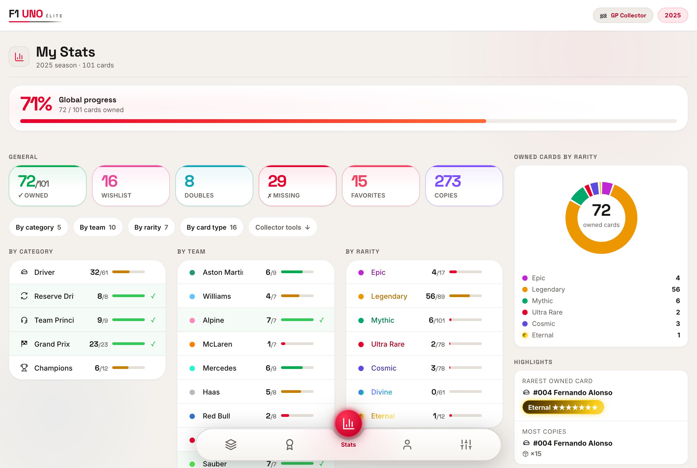 |

<sub>Altre catture in [`screenshots/`](screenshots/) — temi chiaro e scuro, desktop e mobile.</sub>

### ✨ In movimento

| Aggiunta rapida — un tocco, un esemplare | Navigazione a pillola | Badge — 120, sette famiglie | Due stagioni, a un tocco di distanza |
|---|---|---|---|
| 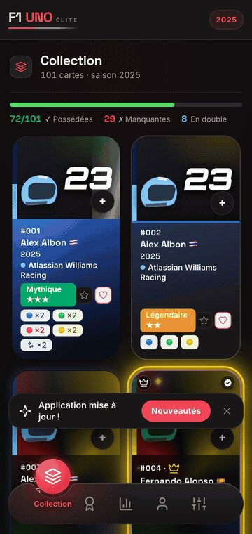 | 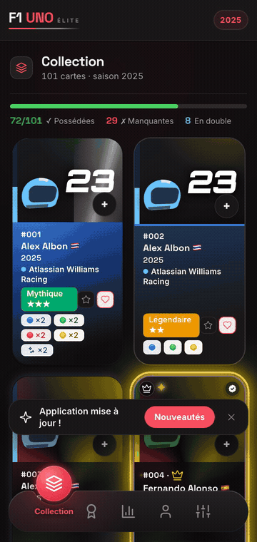 | 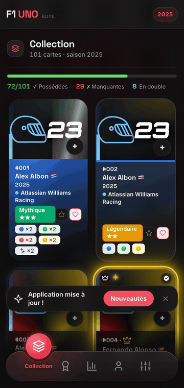 | 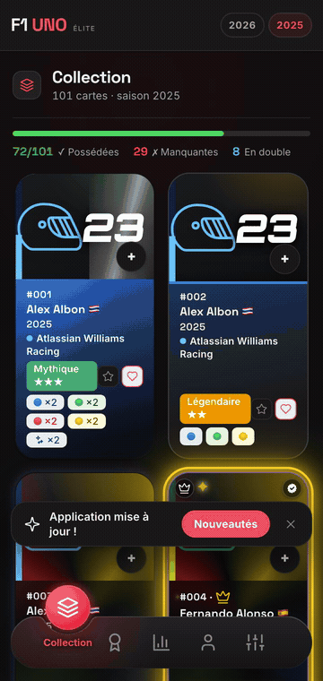 |

Ogni demo è generata da `capture_demos.py` con lo stesso seed deterministico delle catture fisse. I GIF girano a 33,3 fps; la versione a 60 fps è accanto: [aggiunta rapida](screenshots/demo-quick-add.mp4) · [navigazione](screenshots/demo-nav.mp4) · [badge](screenshots/demo-badges.mp4) · [stagioni](screenshots/demo-seasons.mp4).


### Novità 1.29 — la revisione v2

| Badge — famiglie, progresso, obiettivo fissato | Dettaglio badge — data di sblocco, carte contributive |
|---|---|
| 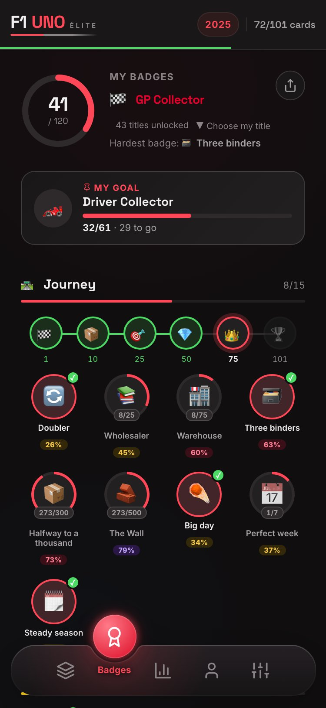 | 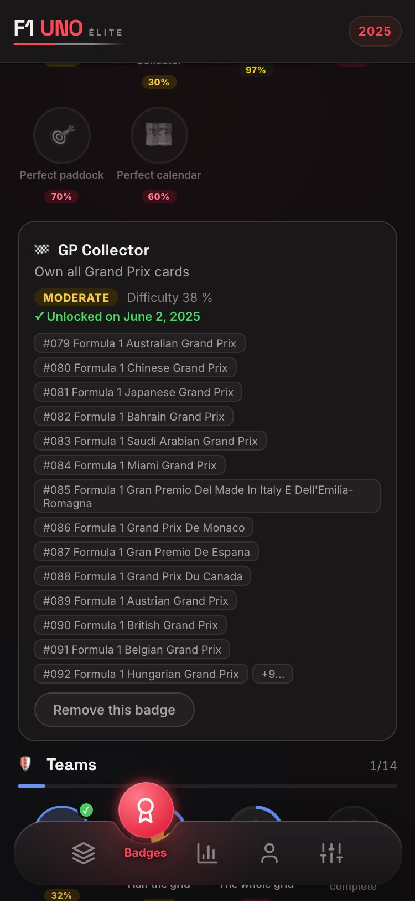 |

| Account — cloud, backup, zona pericolo | Impostazioni — la scheda sicurezza |
|---|---|
| 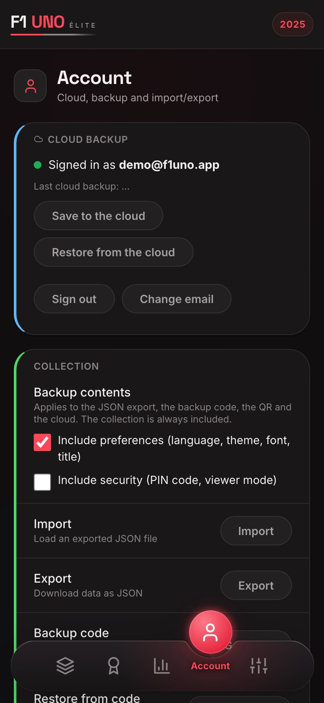 | 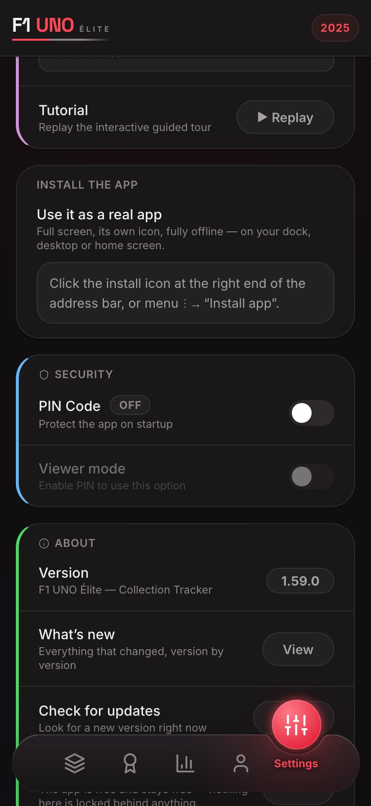 |

| Sblocco PIN — segmentato e mascherato | Codice e-mail — lo stesso componente condiviso |
|---|---|
| 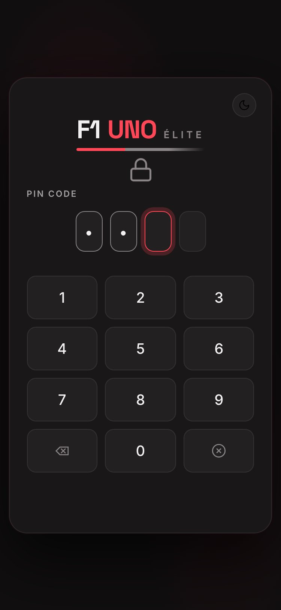 | 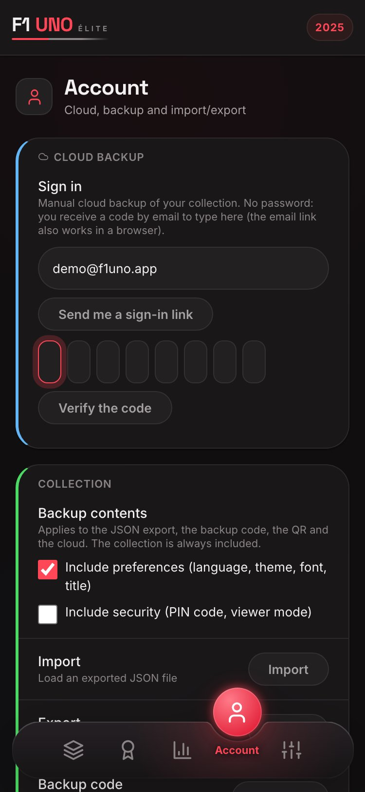 |

| Tracciati dei circuiti — rifatti da rilevamenti GPS reali | Badge — tema chiaro |
|---|---|
| 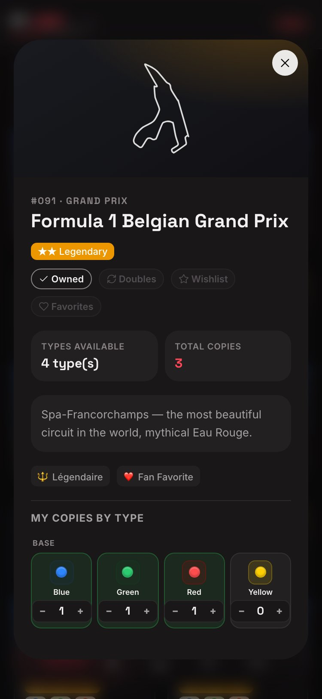 | 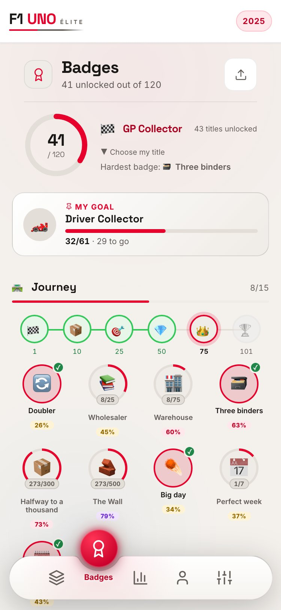 |

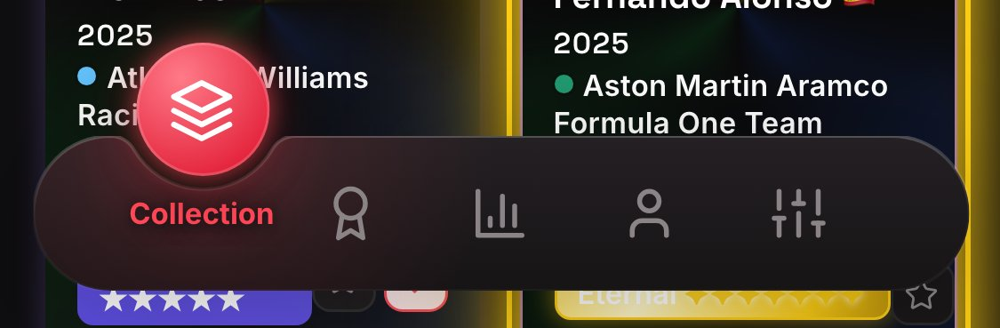

<sub>Localizzato in 7 lingue — ogni testo, badge e voce del changelog</sub>

| Rarità Eterna — campioni con set completo | Aggiunta rapida — selettore di varianti |
|---|---|
| 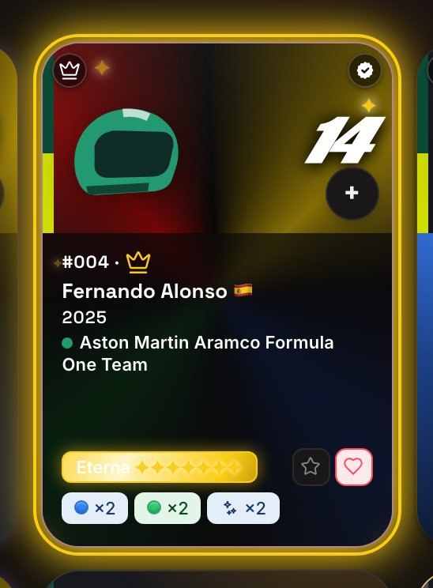 | 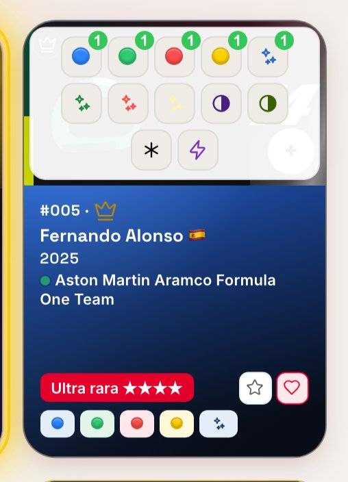 |

| Donut delle rarità con Eterna | Toast Annulla |
|---|---|
| 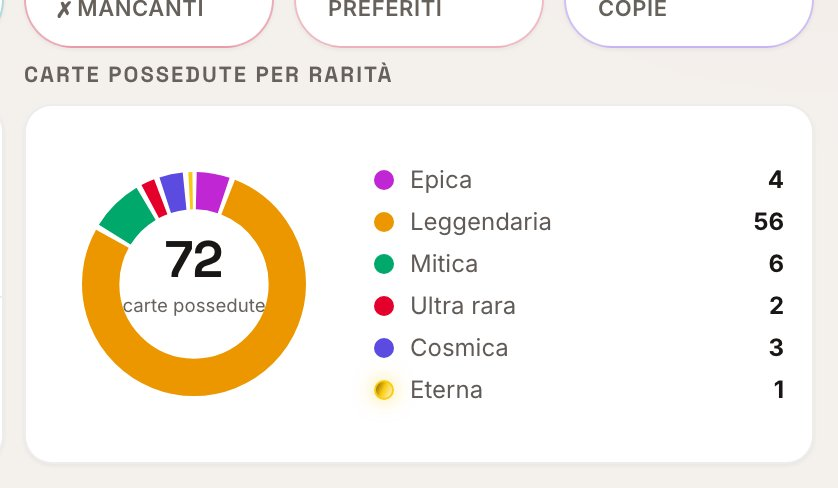 | 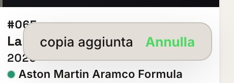 |

---

## ✨ Cosa fa

Tenere traccia di una collezione completa di carte **F1 UNO Élite** — 101 carte per la stagione 2025, ciascuna in fino a 16 varianti (colori base, foil, dual, Wild, Nitro, promo):

- 📇 **Gestione completa della collezione** — possedute / doppioni / wishlist / preferite, quantità per variante, l’intera collezione sempre in vista.
- ➕ **Aggiunta rapida con un gesto** — un pulsante + su ogni tessera apre un selettore di varianti: un tocco aggiunge una copia, con toast «Annulla». L’intestazione mostra i progressi in tempo reale (possedute/totale) sopra una sottile linea di avanzamento.
- ✨ **Sistema di rarità animato a 7 livelli** — `epic → legendary → mythic → ultra → cosmic → divine → eternal`, calcolato dalla migliore variante posseduta, +1 livello quando il set è completo (tutte le varianti possedute) — `eternal` si raggiunge solo così. Le carte foil hanno riflessi di luce animati, `divine` si mostra come un gradiente iridescente ed `eternal` in nero e oro scintillante (il tutto rispettando `prefers-reduced-motion`).
- 📴 **Funziona completamente offline** — l'intera app è precachata da un service worker; dopo la prima visita, la modalità aereo non cambia nulla.
- 🔄 **Aggiornamenti trasparenti** — le nuove versioni vengono rilevate in background e applicate con un tocco, con un changelog integrato che mostra cosa è cambiato dalla *tua* ultima versione.
- 🌍 **7 lingue** — inglese, francese, spagnolo, cinese, italiano, olandese, tedesco. Ogni testo, badge e voce del changelog.
- 🎓 **Tutorial interattivo, 33 passi in 5 capitoli** — un capitolo per pagina, nell’ordine delle schede. Una visita guidata in cui *esegui* le azioni reali, in un ambiente isolato che annulla ogni modifica alla fine.
- 🏅 **Una pagina Badge che racconta la tua collezione** — 120 badge in 7 famiglie: percorso, set completi, foil, colori, passione ed esperienze vissute che convalidi tu stesso. Un anello di progresso con il tuo titolo, una scheda *Prossimo badge* che mette sempre in evidenza il più vicino — o l'obiettivo che hai fissato —, una scala di traguardi da 1 a 101 carte, le date di sblocco e una vera festa quando ne arriva uno: avviso raggruppato, breve vibrazione ed esplosione sulla tessera. La tua carta da collezionista si esporta come immagine condivisibile.
- 📊 **Cruscotto statistiche** — progresso globale, donut delle rarità, completamento per categoria, momenti salienti, una curva di progresso giorno per giorno (SVG puro, nessuna libreria di grafici) e gli strumenti da collezionista come schede interne: liste mancanti, doppioni e scambi.
- 👤 **Una pagina Account dedicata** — accesso cloud tramite codice e-mail, backup/ripristino, esportazione/importazione JSON, trasferimento via QR, feedback integrato e una zona pericolo con tre ambiti di eliminazione, ciascuno protetto da una parola da digitare. In modalità spettatore l'intera pagina è sostituita da uno stato bloccato: i controlli sono assenti, non disattivati.
- 🔁 **Backup ovunque** — export/import JSON, un codice di backup compresso da dispositivo a dispositivo, lo stesso codice come QR scansionabile, e backup cloud opzionale.
- 🔐 **Blocco PIN, modalità spettatore e cifratura opzionale** — un PIN di 4 cifre su un tastierino segmentato (ogni cifra visibile un istante, poi mascherata), percorsi guidati per crearlo/cambiarlo/disattivarlo con progresso visibile, una modalità di sola lettura per condividere e cifratura a riposo opzionale della collezione (PBKDF2 + AES-GCM, derivata dal PIN).
- 🧭 **Una barra di navigazione con pastiglia** — la pillola, la sua tacca e la pastiglia sono un unico tracciato SVG ricalcolato fotogramma per fotogramma da un solo orologio di animazione, così i due non si disallineano mai. Trascinabile, raggiungibile da tastiera e rispetta `prefers-reduced-motion`.

---

## 🛠️ Stack tecnico

| Area | Scelta |
|---|---|
| Linguaggio | **JavaScript vanilla** (moduli ES nativi), HTML5, CSS3 — nessun framework |
| Dipendenze a runtime | **Zero.** Nessun pacchetto npm, nessun CDN, nessun SDK a runtime |
| Build | [esbuild](https://esbuild.github.io/) (l'*unica* devDependency) → un bundle IIFE minificato |
| Offline / PWA | Service Worker scritto a mano (precache versionata, shell cache-first) + Web App Manifest |
| Cloud (opzionale) | **Supabase in `fetch()` REST puro** — senza SDK; auth con codice OTP via e-mail, Row Level Security |
| Crittografia | **Web Crypto** nativo — SHA-256 (PIN), PBKDF2 + AES-GCM (crittografia a riposo opzionale) |
| Codici QR | Encoder a file singolo vendorizzato ([Project Nayuki](https://www.nayuki.io/page/qr-code-generator-library), MIT) |
| Font | WOFF2 self-hosted (SIL OFL) — nessuna richiesta a Google Fonts, 5 temi a scelta |
| Test | **Test runner integrato di Node** (`node --test`) — 816 test, nessun framework di test |
| CI | GitHub Actions — test + build + verifica di freschezza del bundle committato a ogni push/PR |

**Zero dipendenze a runtime è una regola di progettazione, non un caso.** Tutto ciò che un framework o un SDK fornirebbe — rendering, navigazione tra viste, i18n, cache offline, auth via REST, crittografia, generazione di QR — è costruito direttamente sulle API della piattaforma web. L'app che installi è esattamente il codice di questo repository. Da allora: `cloud.js` (726 righe) è stato diviso in quattro moduli dietro 61 test di caratterizzazione mai modificati, il che ha sbloccato `pushSeason(s)` / `listCloudSeasons()` — verificati contro il database Supabase reale; e due falle XSS sono state chiuse alla fonte, in `tEsc()` e ai punti d'ingresso dei dati.

---

## 🧱 L'architettura in breve

Il codice è un insieme di **moduli ES** mirati dietro un unico punto di ingresso, `app.js`, assemblati da esbuild in un `app.bundle.js` committato (GitHub Pages non esegue alcuno step di build). Due punti di ingresso HTML condividono tutto il resto: `index-dev.html` carica i moduli grezzi per lo sviluppo, `index.html` carica il bundle.

| Livello | Moduli |
|---|---|
| Stato e dati | `storage.js` (localStorage, per stagione, migrazione v1→v2), `data.js`, `history.js` |
| Interfaccia | `render.js` (griglia, filtri, scheda carta), `stats.js`, `badges.js`, `pin.js` (impostazioni) |
| Piattaforma | `sw.js` (precache), `update.js` (aggiornamenti), `install.js`, `secure-store.js` |
| Cloud opzionale | `cloud-http/auth/sync/ui.js`, `feedback.js`, `settings-sync.js` — tutti in REST puro |

Le azioni passano da **un unico listener delegato** su `[data-action]` invece che da handler inline — ed è anche ciò che rende possibile la modalità visitatore, dato che un solo insieme `VIEWER_BLOCKED` blocca ogni scrittura. Il testo dell'interfaccia non compare mai nel codice: passa da `t()` su dizionari che coprono tutte e 7 le lingue.

### La forma del progetto

Quattro script classici pubblicano globali `window.__*` prima dei moduli; tutto il resto è un modulo ES dietro un unico punto d'ingresso.

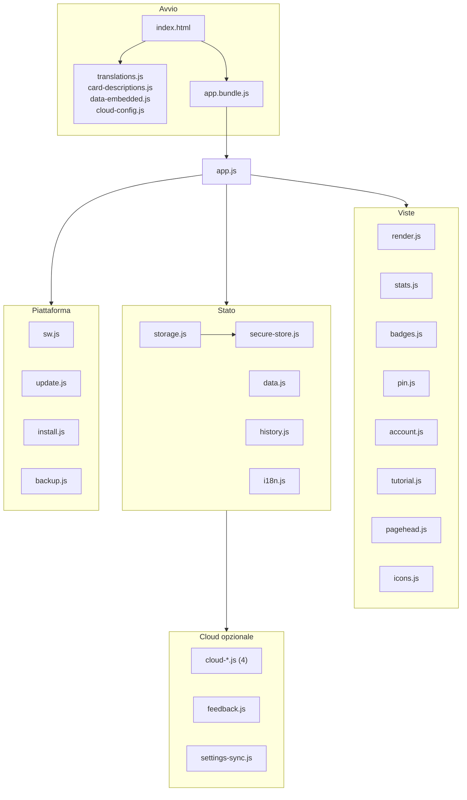


---

## 🧗 Sfide tecniche

I problemi che hanno davvero plasmato questo codice:

### Offline-first *e* sempre aggiornata
Un service worker cache-first rende l'app inossidabile offline — ed eccellente nel servire codice stantio all'infinito. Le PWA installate sono le più colpite: possono restare aperte per giorni senza una navigazione, quindi il browser non ricontrolla mai il worker.
**Soluzione:** il nuovo worker si scarica in background e si parcheggia deliberatamente nello stato *waiting* (niente `skipWaiting` automatico — sostituire la shell sotto un'app in esecuzione è il modo perfetto per corrompere lo stato). Un banner lo promuove con un tocco tramite `SKIP_WAITING`; un banner ignorato si risolve al successivo avvio a freddo. Le PWA installate chiamano inoltre `registration.update()` a ogni ritorno in primo piano e ogni ora. La versione dell'app deriva dalla voce più recente del changelog: pubblicare *è* scrivere il changelog.

### Un accesso via e-mail che sopravvive a una PWA installata
Il classico magic link si rompe nelle PWA installate: il link si apre nel browser predefinito — una partizione di storage diversa — e la sessione atterra dove l'app non c'è.
**Soluzione:** l'autenticazione usa i **codici OTP via e-mail** come via principale, digitati nell'app stessa, quindi la sessione nasce ogni volta nel contesto giusto. L'intero flusso GoTrue è implementato in `fetch()` puro.

### Un service worker che non tocca mai l'API
Un service worker di precache che intercetta tutto servirà volentieri una risposta API dalla cache — un bug silenzioso di corruzione dati che compare solo in produzione.
**Soluzione:** il worker esclude completamente l'origine Supabase, e le chiamate cloud inviano anche `cache: 'no-store'`.

### Un refactor CSS dimostrato identico, byte per byte
Migrare centinaia di valori di spaziatura scritti a mano verso token, con «a me sembra uguale» come unica garanzia.
**Soluzione:** sostituzione solo a corrispondenza esatta, poi una prova — risolvere ogni `var()` di entrambi i fogli di stile in pixel e confrontarli byte per byte. Un passaggio successivo ha dato un nome ai mezzi passi ricorrenti invece di arrotondare 61 dichiarazioni per la sola purezza della scala.

### Feedback con notifica e-mail — senza server
**Soluzione:** un trigger Postgres sulla tabella `feedback` chiama l'API di Resend tramite `pg_net`, interamente dentro Supabase. La chiave API vive cifrata nel Vault, il contenuto dell'utente è escapato in HTML lato SQL, e il trigger inghiotte i propri fallimenti (`exception when others`): una e-mail fallita non può mai bloccare l'inserimento. Un **secondo trigger applica il vero limite di frequenza nel database** — cinque opinioni per utente all'ora, sollevate come `rate_limited` — e l'app traduce quell'errore in un codice tipizzato. L'attesa lato client è una cortesia; la protezione sta sul server.

### Testare un'app per browser senza browser
Mantenere la promessa di zero dipendenze esclude Jest, Vitest e i sistemi con browser headless.
**Soluzione:** la logica è stata fattorizzata per essere indipendente dal browser ed è coperta da **816 test sul runner integrato di Node** — nessuna dipendenza di test, nessuna rete reale. La CI ricostruisce anche il bundle e fallisce se l'artefatto committato è obsoleto.

---

### Cosa coprono i test — e cosa no

816 test sull'esecutore integrato di Node, senza framework. Essere precisi sul confine conta più del numero:

- **Coperto:** migrazioni di archiviazione e schema di chiavi per stagione; la scala di rarità a sette livelli, promozione da set completo inclusa; tutte le condizioni dei distintivi e il modello di difficoltà; le liste del collezionista (mancanti, doppie, scambio); i cicli di codifica dei codici di backup; gli aiutanti cloud contro un `fetch` simulato, percorsi di errore compresi; la parità delle chiavi i18n sulle 7 lingue e il rilevamento dei duplicati; la precache del service worker confrontata col grafo reale degli import; i contratti di markup dell'accesso da tastiera; la provenienza di ogni `innerHTML` alimentato dall'esterno; il contrasto verificato a mano su entrambi i temi.
- **Non coperto:** il rendering reale (nessuna asserzione DOM oltre le stringhe di markup), il comportamento del service worker a runtime, le chiamate di rete reali, IndexedDB, i prompt d'installazione, e tutto ciò che richiede un motore di browser — verificati a mano e dalla passata deterministica di screenshot, non dalla suite. La percentuale citata sopra misura solo questa fetta senza browser — va letta come tale, non come una misura dell'app.

## 🚀 Per iniziare

Un browser moderno e un qualsiasi server HTTP statico (`file://` non basta — i moduli ES e il `fetch()` dei JSON lì sono bloccati).

```bash
# Sviluppo — nessuna build, moduli ES grezzi:
python3 -m http.server 8000
# → http://localhost:8000/index-dev.html

# Bundle di produzione:
npm install     # installa esbuild, l'unica devDependency
npm run build   # app.js → app.bundle.js (minificato + sourcemap)
# → http://localhost:8000/  (index.html)

npm test        # 816 test, node --test, senza framework
```

**Deployment.** Il repository si deploya così com'è su GitHub Pages: tutti gli URL sono relativi, quindi l'app gira identica alla radice di un dominio, sotto un sottopercorso e in localhost. Routine di release: aggiungere una voce al changelog (quello *è* il bump di versione) → incrementare `SW_VERSION` → build → push.

---

## ⚖️ Limiti dichiarati

- **Il PIN è una barriera d'interfaccia, non sicurezza forte.** Senza la crittografia opzionale, la collezione è leggibile in `localStorage` dai DevTools. Con la crittografia attiva, la curiosità casuale è bloccata — ma un PIN a 4 cifre può essere forzato offline da chi ha in mano il dispositivo. Un PIN dimenticato rende irrecuperabile una collezione locale cifrata.
- **Le notifiche delle opinioni partono dal dominio di test di Resend** (`onboarding@resend.dev`). Da quel dominio Resend consegna solo all'indirizzo del proprietario dell'account: la notifica raggiunge il manutentore e nessun altro. Inviare altrove richiederebbe di possedere e verificare un dominio. È un limite assunto, non un difetto: l'opinione viene comunque salvata nel database, e un invio fallito non la blocca mai.
- **I codici di accesso passano da un provider SMTP configurato in Supabase** — una catena del tutto distinta dalle notifiche qui sopra. Recapito, quote e reputazione del mittente dipendono da quel provider e questo repository non li misura; considera le e-mail di accesso come «al meglio» per un progetto personale.
- **La cronologia di progressione non ha back-fill** — la curva delle statistiche parte dal giorno in cui la funzione è stata installata.
- **Il voto Codacy è A — e due dei suoi quattro obiettivi di qualità sono rossi.** Verdi: 0 issue aperte, 4 % di duplicazione. Rossi: la complessità, con 13 dei 30 file sorgente analizzati sopra la soglia **rilevati a luglio 2026** (l'insieme analizzato conta ora 35 file) (43 %, contro un obiettivo del 10 %); e la copertura, al 69,10 % misurato dalla suite di test (l'indicatore di Codacy segna 62 %, su un insieme di file un po' più ampio) contro un obiettivo del 60 % — verde, ma con 2,7 punti di margine. Il badge qui sopra è reale, ma non è il quadro completo — ed è per questo che il quadro completo è qui. La soglia di complessità è regolabile e alzarla renderebbe verde quell'indicatore senza cambiare una riga di codice; non è stata alzata, perché quattro di quei file fanno davvero troppo — i due più pesanti sono `badges.js` e `cloud.js`, e scinderli è il prossimo lavoro, poiché è ciò che separa il progetto dall'esportazione della lista di scambio e dal supporto multi-stagione. Una riserva sulla metrica stessa: conta *file*, quindi penalizza un'architettura fatta di pochi grandi moduli — lo stesso codice distribuito su 300 file passerebbe senza cambiare una riga. È un fatto sulla misura, non una scusa.

---

## 🔩 Note di ingegneria

Zero dipendenze a runtime (solo esbuild, in build); soglia tipografica di 11 px verificata su 5 caratteri × 2 temi × 320/375/desktop (una sola eccezione, l'« ÉLITE » del logo a 8 px, che è branding); spostamento di layout misurato, e ora davvero nullo: l'altezza della tessera è FISSA (prima 13 altezze distinte, da 246,69 a 292,69 px), lo scheletro legge la stessa variabile CSS e combacia esattamente — al prezzo di +19,4 % di scorrimento, il costo di riservare ovunque il caso peggiore; l'aggiunta rapida profilata e ottimizzata (~300 ms → ~45 ms su un telefono medio, misura singola non ripetuta in CI); cifratura locale opzionale legata al PIN (PBKDF2 + AES-GCM); modalità spettatore bloccata nella logica, non nel CSS; screenshot rigenerati da uno script deterministico nel repo, le quattro demo animate scriptate e riproducibili; 816 test in JS vanilla con il runner integrato di Node. Dettagli completi nel [README inglese](README.md).

---

## ☕ Sostenere lo sviluppatore

Un unico link in uscita, in **Impostazioni → Info**, porta a [Ko-fi](https://ko-fi.com/arts44). Sostiene **me, lo sviluppatore** — non l'app né il suo universo. Nessuno script di terze parti, nessun pixel di tracciamento, nessun dato personale lascia il dispositivo: è un `<a target="_blank" rel="noopener noreferrer">`, nient'altro. L'URL vive in una costante unica (`SUPPORT_URL` in `pin.js`); svuotarla fa sparire la riga. Offline la riga diventa visibilmente inerte invece di portare a una pagina morta.

**Donare non sblocca nulla** — nessuna funzione, nessun badge, nessun nome in un elenco. Una donazione che comprasse qualcosa sarebbe un acquisto, e questo progetto resta un progetto amatoriale non commerciale.

---

## 📜 Licenza e marchi

Rilasciato sotto **licenza MIT** — vedi [LICENSE](LICENSE). © 2026 Arthur — [@Arts44](https://github.com/Arts44).

> **Progetto amatoriale non ufficiale, non commerciale.** «F1» e «UNO», insieme ai loghi e alle immagini di team e piloti, appartengono ai rispettivi proprietari. Questo strumento non è affiliato, approvato o sponsorizzato da Formula 1, Mattel o alcun team.
