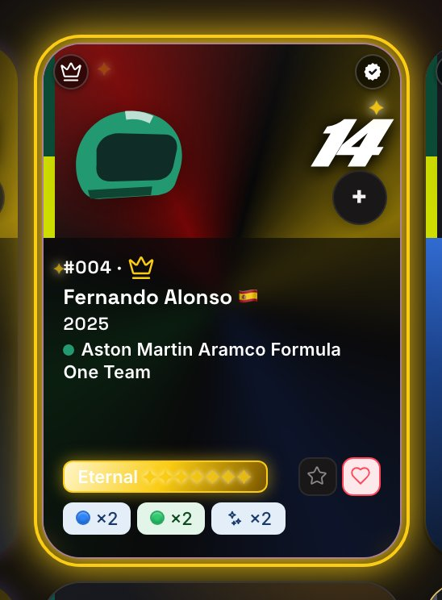
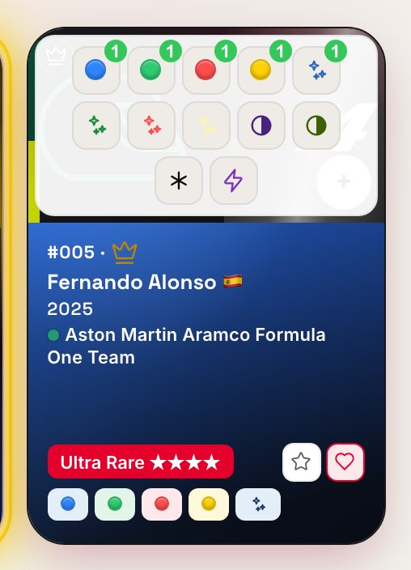
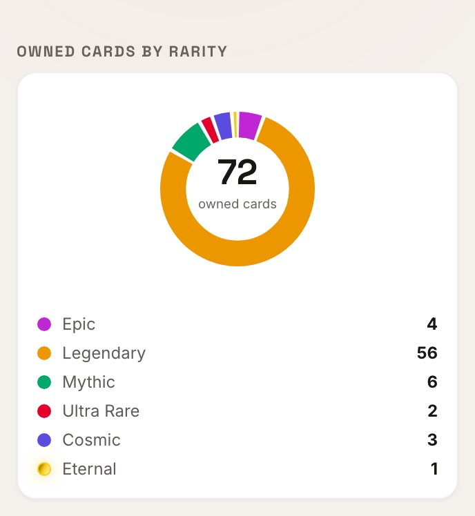
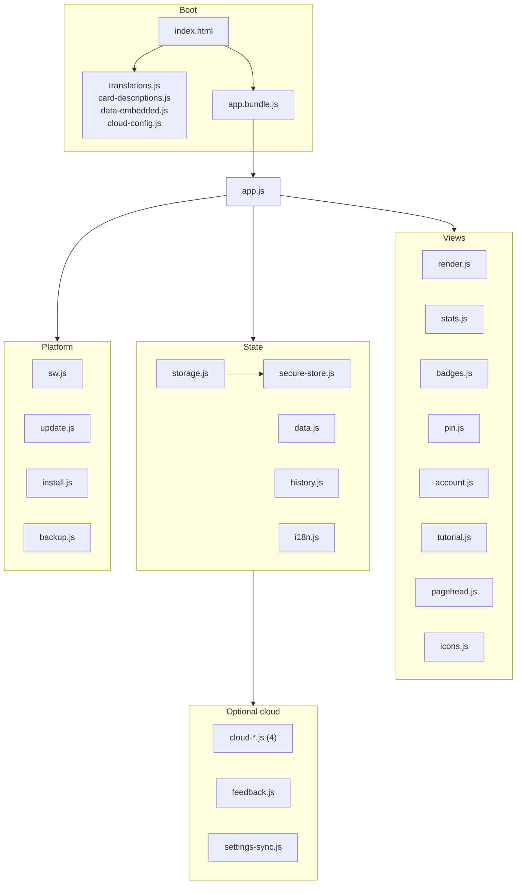

🇬🇧 **English** · [🇫🇷 Français](README.fr.md) · [🇪🇸 Español](README.es.md) · [🇨🇳 中文](README.zh.md) · [🇮🇹 Italiano](README.it.md) · [🇳🇱 Nederlands](README.nl.md) · [🇩🇪 Deutsch](README.de.md)

# 🏎️ F1 UNO Élite — Collection Tracker

**An offline-first, installable trading-card collection tracker built with vanilla JavaScript and zero runtime dependencies — no framework, no SDK, no CDN, no backend.**

[](https://github.com/Arts44/f1-uno-elite/actions/workflows/tests.yml)


[](https://app.codacy.com/gh/Arts44/f1-uno-elite/dashboard)

## ▶️ **[Try it live → arts44.github.io/f1-uno-elite](https://arts44.github.io/f1-uno-elite/)**

It's a **PWA**: install it from your browser and it runs like a native app, fully offline, with its own icon — on desktop and mobile.


| Card sheet — animated foil types | Stats dashboard |
|---|---|
|  |  |

<sub>More captures in [`screenshots/`](screenshots/) — light and dark themes, desktop and mobile.</sub>

### ✨ In motion

| Quick add — one tap, one copy | Bead navigation | Badges — 120, seven families | Two seasons, one tap apart |
|---|---|---|---|
|  |  |  |  |

Every demo is generated by `capture_demos.py` from the same deterministic seed as the still captures — no hand recording. Each GIF runs at 33.3 fps, the fastest even step the format allows; the 60 fps version is next to it: [quick add](screenshots/demo-quick-add.mp4) · [navigation](screenshots/demo-nav.mp4) · [badges](screenshots/demo-badges.mp4) · [seasons](screenshots/demo-seasons.mp4).


### Badges — families, progress, difficulty

| Badges — families, progress, pinned goal | Badge detail — unlock date, contributing cards |
|---|---|
|  |  |

| Account — cloud, backups, danger zone | Settings — the security card |
|---|---|
|  |  |

| PIN unlock — segmented and masked | Email code — the same shared component |
|---|---|
|  |  |

| Circuit outlines — rebuilt from real GPS traces | Badges — light theme |
|---|---|
|  |  |

| Guided tour — five chapters, one per page | The five foil families, at the calmed level |
|---|---|
|  |  |


<sub>Localised in 7 languages — every string, badge and changelog entry</sub>

| Eternal rarity — complete-set champions | Quick add — variant picker |
|---|---|
|  |  |

| Rarity donut with Eternal | Undo toast |
|---|---|
|  |  |

---

## ✨ What it does

Track a complete **F1 UNO Élite** trading-card collection — 101 cards for the 2025 season, each existing in up to 16 variants (base colours, foils, duals, Wild, Nitro, promos):

- 📇 **Full collection management** — owned / doubles / wishlist / favourites, per-variant quantities, the whole collection always in view.
- ➕ **One-gesture quick add** — a + button on every tile opens a variant picker: one tap adds a copy, with an Undo toast. The Collection page header shows your live progress: a bar plus owned / missing / doubles.
- ✨ **Animated 7-level rarity system** — `epic → legendary → mythic → ultra → cosmic → divine → eternal`, computed from the best owned variant, +1 level when the set is complete (every variant owned) — `eternal` is only reachable that way. Foil cards carry live light-sweep visuals and the top tier renders as a shifting iridescent gradient (all respecting `prefers-reduced-motion`).
- 📴 **Works fully offline** — the whole app is precached by a service worker; after the first visit, airplane mode changes nothing.
- 🔄 **Transparent auto-updates** — new versions are detected in the background and applied with one tap, plus an in-app changelog showing what changed since *your* last version.
- 🌍 **7 languages** — English, French, Spanish, Chinese, Italian, Dutch, German. Every string, badge and changelog entry.
- 🎓 **Interactive tutorial, 33 steps in 5 chapters** — one chapter per page, in tab order. A guided tour where you *perform* the real actions, running in a sandbox that reverts every change when it ends.
- 🏅 **A badges page that tells your story** — 120 badges in 7 families: journey, complete sets, teams, foils, colours, passion, and real-world experiences you validate yourself. Every badge carries an **intrinsic difficulty score** (0–100) computed from the acquisition effort it demands — not from telemetry, which this app does not collect. A progress ring with your title, a *Next badge* card that always surfaces the closest one — or the goal you pinned — a milestone ladder from 1 to 101 cards, unlock dates, and a real celebration when one drops: a grouped toast, a short haptic tap, and a burst on the tile. Your collector card exports as a shareable image.
- 📊 **Stats dashboard** — global progress, rarity donut, per-category completion, highlights, a day-by-day progression curve (pure SVG, no chart library), and the collector tools as inner tabs: missing, doubles and trade lists.
- 👤 **A dedicated Account page** — cloud sign-in by email code, push/pull backups, JSON export/import, the QR transfer, in-app feedback, and a danger zone offering three deletion scopes, each gated behind a word you must type. In viewer mode the whole page is replaced by a locked state — the controls are absent, not disabled.
- 🔁 **Backups everywhere** — JSON export/import, a compressed device-to-device backup code, the same code as a scannable QR link, and optional cloud backup.
- 🔐 **PIN lock, viewer mode & optional encryption** — a 4-digit PIN on a segmented keypad (each digit briefly visible, then masked), guided flows to create/change/disable it with visible progress, a read-only sharing mode, and opt-in at-rest encryption of the collection (PBKDF2 + AES-GCM, keyed off the PIN).
- 🧭 **A navigation bar with a bead** — the pill, its notch and the bead are a single SVG path recomputed per frame from one animation clock, so the two never drift apart. Draggable, keyboard-reachable, and it respects `prefers-reduced-motion`.

---

## 🛠️ Tech stack

| Area | Choice |
|---|---|
| Language | **Vanilla JavaScript** (native ES modules), HTML5, CSS3 — no framework |
| Runtime dependencies | **Zero.** No npm packages, no CDN, no SDK at runtime |
| Build | [esbuild](https://esbuild.github.io/) (the *only* devDependency) → one minified IIFE bundle |
| Offline / PWA | Hand-written Service Worker (versioned precache, cache-first shell) + Web App Manifest |
| Cloud (optional) | **Supabase over raw REST `fetch()`** — no SDK; email OTP auth, Row Level Security |
| Crypto | Native **Web Crypto** — SHA-256 (PIN), PBKDF2 + AES-GCM (optional at-rest encryption) |
| QR codes | Vendored single-file encoder ([Project Nayuki](https://www.nayuki.io/page/qr-code-generator-library), MIT) |
| Fonts | Self-hosted WOFF2 (SIL OFL) — no Google Fonts request, 5 switchable themes |
| Tests | **Node's built-in test runner** (`node --test`) — 862 tests, no test framework |
| CI | GitHub Actions — tests + build + committed-bundle freshness check on every push/PR |

**Zero runtime dependencies is a design rule, not an accident.** Everything a framework or SDK would normally provide — rendering, view routing, i18n, offline caching, auth over REST, encryption, QR generation — is built directly on web platform APIs. The app you install is exactly the code in this repo.

---

## 🧱 Architecture in brief

The source is a set of focused **ES modules** behind a single entry point, `app.js`, bundled by esbuild into one committed `app.bundle.js` (GitHub Pages runs no build step). Two HTML entry points share everything else: `index-dev.html` loads the raw modules for development, `index.html` loads the bundle.

| Layer | Modules |
|---|---|
| State & data | `storage.js` (localStorage, season-scoped, v1→v2 migration), `data.js`, `history.js` |
| UI | `render.js` (grid, card sheet), `stats.js`, `badges.js`, `pin.js` (settings), `icons.js` |
| Platform | `sw.js` (precache), `update.js` (update flow), `install.js`, `secure-store.js` |
| Optional cloud | `cloud-http/auth/sync/ui.js`, `feedback.js`, `settings-sync.js` — all raw REST |

User actions run through **one delegated listener** on `[data-action]` rather than inline handlers — which is also what makes read-only viewer mode possible, since a single `VIEWER_BLOCKED` set gates every write. Interface text never appears in the code: it goes through `t()` against dictionaries covering all 7 languages.

### The shape of it

Four classic scripts publish `window.__*` globals before the modules load; everything else is an ES module behind one entry point.




---

## 🧗 Technical challenges

The problems that actually shaped this codebase:

### Offline-first *and* always up to date
A cache-first service worker makes the app bulletproof offline — and excellent at serving stale code forever. Installed PWAs are worst hit: they can stay open for days without a navigation, so the browser never re-checks the worker.
**Solution:** the new worker downloads in the background and deliberately parks in *waiting* (no auto `skipWaiting` — swapping the shell under a running app is how you corrupt state). A one-tap banner promotes it via `SKIP_WAITING`; ignored banners resolve on the next cold start. Installed PWAs additionally call `registration.update()` on every return to the foreground and hourly. The app version derives from the newest changelog entry, so releasing *is* writing the changelog.

### Email sign-in that survives an installed PWA
Classic magic-link auth breaks in installed PWAs: the link opens in the default browser — a different storage partition — so the session lands where the app isn't.
**Solution:** authentication uses **email OTP codes** as the primary path, typed into the app itself, so the session is created in the right context every time. The whole GoTrue flow is implemented over raw `fetch()`.

### A service worker that never touches the API
A precaching worker that intercepts everything will happily serve a cached API response — a silent data-corruption bug that only shows up in production.
**Solution:** the worker excludes the Supabase origin entirely, and cloud calls also send `cache: 'no-store'`.

### A CSS refactor proven identical, byte for byte
Migrating hundreds of hard-coded spacing values to design tokens, with "it looks the same to me" as the only guarantee.
**Solution:** exact-match substitution only, then a proof — resolve every `var()` in both stylesheets down to pixels and byte-compare them. A later pass named the recurring half-steps rather than rounding 61 declarations for scale purity alone.

### Feedback with email notifications — without a server
**Solution:** a Postgres trigger on the `feedback` table calls the Resend API through `pg_net`, entirely inside Supabase. The API key lives encrypted in the Vault, user content is HTML-escaped in SQL, and the trigger swallows its own failures (`exception when others`) so a failing email can never block the insert. A **second trigger enforces the real rate limit in the database** — five entries per user per hour, raised as `rate_limited` — and the app maps that error to a typed code. The client-side cool-down is a courtesy; the protection is server-side.

### Testing a browser app without a browser
Keeping a zero-dependency promise rules out Jest, Vitest and headless-browser harnesses.
**Solution:** the logic was factored to be browser-free and is covered by **862 tests on Node's built-in runner** — no test dependencies, no real network. CI also rebuilds the bundle and fails if the committed artifact is stale.

---

## 🔩 Engineering notes

The choices a technical reader might want spelled out:

- **Zero runtime dependencies, on purpose.** No framework, SDK, CDN or font service — the only dependency is `esbuild`, at build time. Supabase is spoken to in raw `fetch()`; the QR encoder is vendored (MIT). The app cannot rot because a package did, and the offline promise has no hidden network edges.
- **Layout shift is measured, not assumed — and it is now actually zero.** Tile height used to follow how driver and team names wrapped and whether a copies pill was present: at 375×812 that produced **13 distinct heights** (246.69–292.69 px) across a **14 283 px** grid, so one long name stretched its whole row and left its neighbours with dead space. Tiles now have a **single fixed height** — the card name is clamped to two lines, the copies slot is always reserved, and the rarity row is pinned to the bottom, which also aligns it across neighbouring tiles. Measured after: **one height, a 17 052 px grid — +19.4 % of scrolling**, the price of reserving the worst case everywhere. The loading skeleton reads the same CSS variable as the tile, so it is exact rather than median-fitted; a test asserts they share it.
- **An 11 px typographic floor, with its one exception named.** Sub-12 px text was the last untreated legibility grievance. The 68 declarations were inventoried and arbitrated one at a time rather than swept to a single value, and the result was verified across **5 font themes × 2 colour themes × 320 / 375 / desktop**: informative text now renders at 11 px or above everywhere, with exactly one survivor — the 8 px `ÉLITE` in the wordmark, which is branding, not text to read. Two consequences worth spelling out. Long team names on tiles are clamped to two lines with an ellipsis instead of sliding behind the quick-add button — an ellipsis says « truncated », a masked glyph reads as a rendering bug; `-webkit-line-clamp` cuts at the line, not the word, so « …FORMULA ON… » is a limit of the technique, and the full name stays readable at 13 px in the card sheet. And the donut's inner label was fixed by enlarging the **donut** (140 → 165 px), not the type: its 8 px sits in a 120-unit `viewBox`, so it renders at exactly 11 px. Its label still overruns the hole by 3.2 viewBox units — a pre-existing ratio the scaling preserves, left as documented debt because fixing it means rewording a string in seven languages.
- **Performance fixed by measurement.** The quick-add path was profiled (CDP, CPU×6): one tap used to trigger up to five full save+badge-evaluation passes and a 101-tile rebuild — batched writes and targeted tile updates brought it from ~300 ms to ~45 ms on a mid-range phone profile. That figure comes from a one-off session, not a committed benchmark — it is reported as an order of magnitude, and no script in this repo reproduces it.
- **Optional at-rest encryption keyed to the PIN** (PBKDF2 + AES-GCM via Web Crypto), with the trade-offs documented honestly below rather than oversold.
- **Viewer (read-only) mode is enforced in logic**, not hidden by CSS: every write action passes one guard set, and direct function calls refuse too.
- **A 726-line module was split, and the split unlocked a feature.** `cloud.js` did four jobs at once; it became `cloud-http` (transport), `cloud-auth` (session), `cloud-sync` (rows) and `cloud-ui` (DOM). The 61 characterisation tests written first were never modified across the five moves — that was the point. What it unlocked: the season had been an *ambient* value read in three places, so pushing 2026 meant switching the whole app to 2026 first, and listing what the cloud held was impossible because the query was pinned to the season on screen. `pushSeason(s)` / `pullSeason(s)` / `listCloudSeasons()` fell out of the split.
- **Multi-season sync was verified against the real database, not a stub.** Signed in with a real account: `listCloudSeasons()` returned `[2025]`, `pushSeason(2026)` wrote its row while the app stayed on 2025 — the exact thing that was impossible before — and the list came back `[2026, 2025]`. The pull was taken to its import dialog and cancelled; the local collection did not move. The test row was then deleted, and its absence proven by reading again rather than by trusting the delete call's return value, which is `true` either way.
- **Two XSS holes were closed at the source, not patched at the symptom.** Translated strings and card data were interpolated straight into `innerHTML`; any `<` in a name or a translation was live markup. Escaping was pushed into `tEsc()` and the data entry points rather than sprinkled at call sites, so the next interpolation is safe by default instead of by vigilance.
- **The visual freeze is reproducible.** Every still capture in this README is regenerated by a deterministic in-repo script — seed computed from the card data, honesty-checked, and **byte-identical between runs**: every animation is frozen at a chosen phase before each shot, so two regenerations of an unchanged app produce two identical files. A capture diff is a signal, not noise. — a badge may not appear unlocked unless its condition truly holds. The four animated demos are generated the same way, by `capture_demos.py`, which also checks frame by frame that the 280 ms nav-bead glide is sampled above 30 fps.
- **862 tests on vanilla JS, no test framework** — Node's built-in runner over the browser-free logic: storage migrations, rarity ladder, badge conditions and difficulty model, cloud failure scenarios with stubbed `fetch`, backup codes, i18n coverage. Stat and rarity palettes are contrast-checked by hand in both themes when they change; no automated scan is committed here.

### What the tests cover — and what they don't

862 tests on Node's built-in runner, no test framework. Being precise about the boundary matters more than the number:

- **Covered:** storage migrations and the season-scoped key scheme; the seven-level rarity ladder including complete-set promotion; all badge conditions and the difficulty model; collector lists (missing, doubles, trade); backup encode/decode round-trips; cloud helpers against a stubbed `fetch`, including failure paths; i18n key parity across the 7 languages and duplicate-key detection; the service-worker precache against the real import graph; markup contracts for keyboard access; provenance of every externally-fed `innerHTML`; contrast checked by hand across both themes.
- **Not covered:** actual rendering (no DOM assertions beyond markup strings), the service worker's runtime fetch behaviour, real network calls, IndexedDB, install prompts, and anything requiring a browser engine — those are verified by hand and by the deterministic screenshot pass, not by the suite. The coverage figure quoted above measures only this browser-free slice — read it as such, not as a measure of the app.

## 🚀 Getting started

A modern browser and any static HTTP server (`file://` won't do — ES modules and JSON `fetch()` are blocked there).

```bash
# Development — no build step, raw ES modules:
python3 -m http.server 8000
# → http://localhost:8000/index-dev.html

# Production bundle:
npm install     # installs esbuild, the only devDependency
npm run build   # app.js → app.bundle.js (minified + sourcemap)
# → http://localhost:8000/  (index.html)

npm test        # 862 tests, node --test, no framework
```

**Deployment.** The repo deploys as-is to GitHub Pages: every URL is relative, so the app runs identically at a domain root, under a sub-path, and on localhost. Release routine: add a changelog entry (that *is* the version bump) → bump `SW_VERSION` → build → push.

---

## ⚖️ Honest limits

- **The PIN is an interface barrier, not strong security.** Without the optional encryption, the collection is readable in `localStorage` via DevTools. With encryption on, casual snooping is blocked — but a 4-digit PIN can be brute-forced offline by someone holding the device. A forgotten PIN makes an encrypted local collection unrecoverable.
- **Feedback notifications are sent from Resend's test domain** (`onboarding@resend.dev`). Resend only delivers from that domain to the account owner's own address, so the notification reaches the maintainer and nobody else. Sending from anywhere else would mean owning and verifying a domain. This is a deliberate limit, not a bug: feedback is stored in the database either way, and a failed send never blocks it.
- **Sign-in codes travel over a custom SMTP provider configured in Supabase** — a chain entirely separate from the feedback notifications above. Delivery, quotas and sender reputation depend on that provider and are not measured by this repository; treat sign-in emails as best-effort for a personal project.
- **Progression history has no back-fill** — the stats curve starts the day the feature was installed.
- **The Codacy grade is A — and one of its four quality goals is red.** Measured on commit `b680aed`, 123 files, 9 643 lines. Green: duplication at 5 % (goal 10 %), and coverage at 69 % — Codacy's gauge and the local `npm run test:cov` agree to a tenth this time (69.21 %), against a 60 % goal, so nine points of margin instead of the 2.7 it used to be. Red: complexity, with **45 % of analysed files above the threshold** against a 10 % goal — the ratio went *up* after `cloud.js` was split into four, which says something about the metric: it counts *files*, so a codebase of a few large modules is penalised while the same code spread over 300 files would pass without a line changing. That is a fact about the measurement, not an excuse; `badges.js` genuinely does too much. And a fourth number the badge hides: **2 open issues**, down from 11 — the 8 in the capture scripts and the 2 unused variables in `account.js` were fixed rather than silenced (`c5941cd`). Both survivors are the **same rule firing on a string that is not a secret**: a fake token in `capture_seed.py` (`demo.access.token`, dev tooling that never ships) and `SESSION_KEY = 'f1uno_cloud_session'` in `cloud-auth.js`, which is the *name* of a localStorage key. They are left visible on purpose — a false positive that stays on the dashboard costs one line of explanation, whereas disabling the rule would also hide the true positive it is meant to catch. The badge above is real; it is not the whole picture, which is why the whole picture is here.

---

## ☕ Supporting the developer

A single outbound link in **Settings → About** points to [Ko-fi](https://ko-fi.com/arts44). It supports **me, the developer** — not the app, and not its subject matter. There is no third-party script, no tracking pixel and no personal data leaving the device: it is an `<a target="_blank" rel="noopener noreferrer">` and nothing more. The URL lives in a single constant (`SUPPORT_URL` in `pin.js`); emptying it removes the row entirely. Offline, the row is visibly inert rather than leading to a dead page.

**Nothing is unlocked by donating** — no feature, no badge, no name in a list. A donation that bought something would be a purchase, and this project stays a non-commercial fan project.

---

## 📜 License & trademarks

Released under the **MIT License** — see [LICENSE](LICENSE). © 2026 Arthur — [@Arts44](https://github.com/Arts44).

> **Unofficial fan project, non-commercial.** "F1" and "UNO", along with team and driver logos and images, are the property of their respective owners. This tool is not affiliated with, endorsed by, or sponsored by Formula 1, Mattel, or any team.
