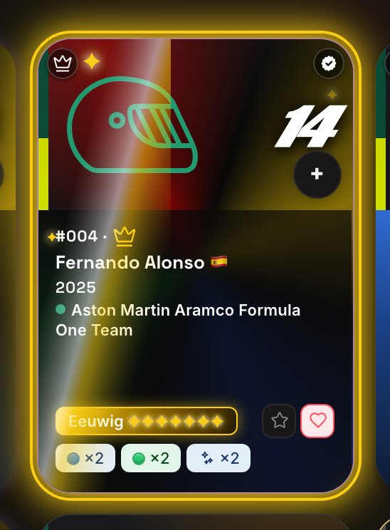
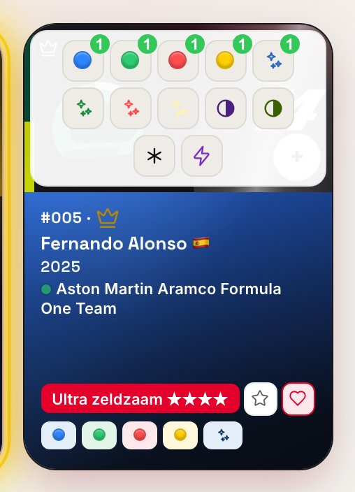
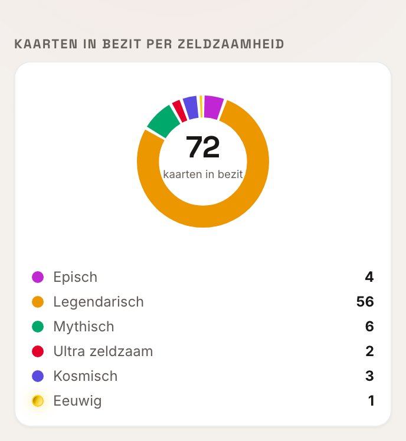
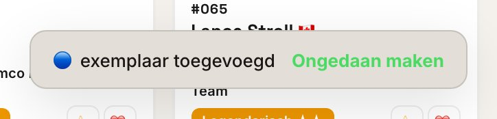
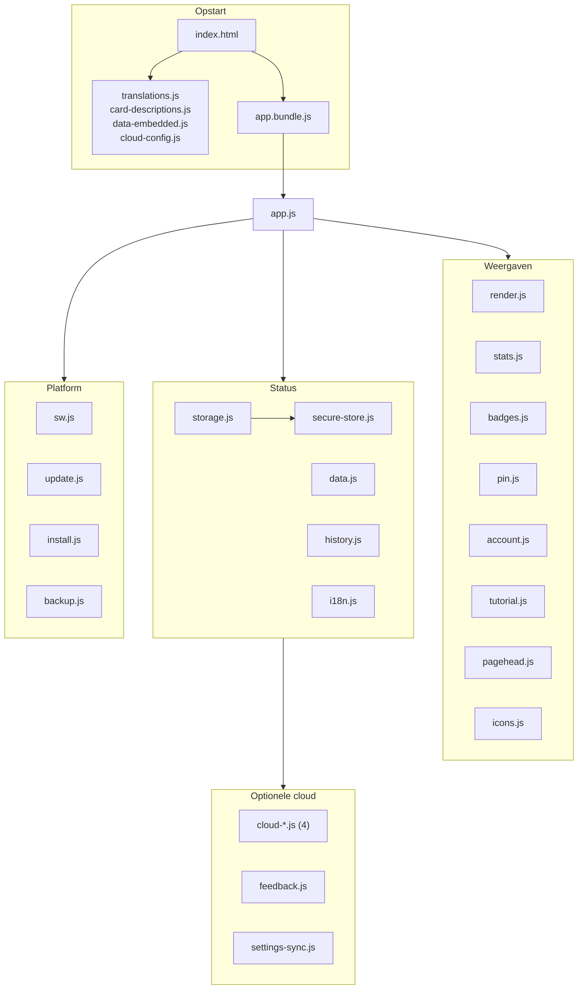

[🇬🇧 English](README.md) · [🇫🇷 Français](README.fr.md) · [🇪🇸 Español](README.es.md) · [🇨🇳 中文](README.zh.md) · [🇮🇹 Italiano](README.it.md) · 🇳🇱 **Nederlands** · [🇩🇪 Deutsch](README.de.md)

# 🏎️ F1 UNO Élite — Collection Tracker

**Een offline-first, installeerbare tracker voor een ruilkaartencollectie, gebouwd met vanilla JavaScript en nul runtime-afhankelijkheden — geen framework, geen SDK, geen CDN, geen backend.**

[](https://github.com/Arts44/f1-uno-elite/actions/workflows/tests.yml)


[](https://app.codacy.com/gh/Arts44/f1-uno-elite/dashboard)

## ▶️ **[Probeer live → arts44.github.io/f1-uno-elite](https://arts44.github.io/f1-uno-elite/)**

Het is een **PWA**: installeer haar vanuit je browser en ze draait als een native app, volledig offline, met een eigen icoon — op desktop én mobiel.


| Kaartfiche — geanimeerde foil-types | Statistiekendashboard |
|---|---|
|  |  |

<sub>Meer schermafbeeldingen in [`screenshots/`](screenshots/) — licht en donker thema, desktop en mobiel.</sub>

### ✨ In beweging

| Snel toevoegen — één tik, één exemplaar | Navigatie met bolletje | Badges — 120, zeven families | Twee seizoenen, één tik uit elkaar |
|---|---|---|---|
|  |  |  |  |

Elke demo komt uit `capture_demos.py`, met dezelfde deterministische seed als de stilstaande beelden, die **byte voor byte identiek** zijn tussen twee runs: elke animatie wordt vóór elke opname op een gekozen fase bevroren. De GIF's draaien op 33,3 fps; de 60 fps-versie staat ernaast: [snel toevoegen](screenshots/demo-quick-add.mp4) · [navigatie](screenshots/demo-nav.mp4) · [badges](screenshots/demo-badges.mp4) · [seizoenen](screenshots/demo-seasons.mp4).


### Nieuw in 1.29 — de v2-ronde

| Badges — families, voortgang, vastgezet doel | Badgedetail — ontgrendeldatum, bijdragende kaarten |
|---|---|
|  |  |

| Account — cloud, back-ups, gevarenzone | Instellingen — de beveiligingskaart |
|---|---|
|  |  |

| Pincode-ontgrendeling — gesegmenteerd en gemaskeerd | E-mailcode — hetzelfde gedeelde component |
|---|---|
|  |  |

| Circuitlijnen — opnieuw getekend uit echte GPS-data | Badges — licht thema |
|---|---|
|  |  |

| Rondleiding — vijf hoofdstukken, één per pagina | De vijf foilfamilies, op het gekalmeerde niveau |
|---|---|
|  |  |


<sub>Gelokaliseerd in 7 talen — elke tekst, badge en changelog-regel</sub>

| Eeuwige zeldzaamheid — kampioenen met complete set | Snel toevoegen — variantkiezer |
|---|---|
|  |  |

| Zeldzaamheidsdonut met Eeuwig | Ongedaan maken-melding |
|---|---|
|  |  |

---

## ✨ Wat het doet

Een complete **F1 UNO Élite**-ruilkaartencollectie bijhouden — 101 kaarten voor het seizoen 2025, elk in tot 16 varianten (basiskleuren, foils, duals, Wild, Nitro, promo's):

- 📇 **Volledig collectiebeheer** — in bezit / dubbelen / verlanglijst / favorieten, aantallen per variant, de hele collectie altijd in beeld.
- ➕ **Snel toevoegen met één gebaar** — een +-knop op elke tegel opent een variantkiezer: één tik voegt een exemplaar toe, met een “Ongedaan maken”-melding. De koptekst toont je live voortgang (in bezit/totaal) boven een dunne voortgangslijn.
- ✨ **Geanimeerd zeldzaamheidssysteem met 7 niveaus** — `epic → legendary → mythic → ultra → cosmic → divine → eternal`, berekend uit de beste variant in bezit, +1 niveau wanneer de set compleet is (elke variant in bezit) — `eternal` is alleen zo bereikbaar. Foil-kaarten dragen bewegende lichtglans-effecten, `divine` toont een iriserend verloop en `eternal` fonkelend zwart-goud (alles met respect voor `prefers-reduced-motion`).
- 📴 **Werkt volledig offline** — de hele app wordt door een service worker geprecachet; na het eerste bezoek verandert vliegtuigmodus niets.
- 🔄 **Transparante auto-updates** — nieuwe versies worden op de achtergrond gedetecteerd en met één tik toegepast, met een ingebouwde changelog die toont wat er sinds *jouw* laatste versie veranderde.
- 🌍 **7 talen** — Engels, Frans, Spaans, Chinees, Italiaans, Nederlands, Duits. Elke tekst, badge en changelog-vermelding.
- 🎓 **Interactieve tutorial, 33 stappen in 5 hoofdstukken** — één hoofdstuk per pagina, in tabvolgorde. Een rondleiding waarin je de *echte* acties uitvoert, in een zandbak die elke wijziging aan het eind terugdraait.
- 🏅 **Een badgepagina die je verzameling vertelt** — 120 badges in 7 families: parcours, complete sets, foils, kleuren, passie en zelf te bevestigen ervaringen. Een voortgangsring met je titel, een *Volgende badge*-kaart die altijd de dichtstbijzijnde toont — of het doel dat je zelf vastzette —, een mijlpalenladder van 1 tot 101 kaarten, ontgrendeldata en een echte viering als er één valt: gebundelde melding, korte trilling en een uitbarsting op de tegel. Je verzamelaarskaart exporteert als deelbare afbeelding.
- 📊 **Statistiekendashboard** — algemene voortgang, zeldzaamheidsdonut, voltooiing per categorie, hoogtepunten, een dag-voor-dag voortgangscurve (pure SVG, geen grafiekbibliotheek) en de verzamelaarstools als interne tabbladen: ontbrekende kaarten, dubbels en ruillijsten.
- 👤 **Een aparte Account-pagina** — cloud-aanmelding via e-mailcode, back-up/herstel, JSON-export/import, QR-overdracht, feedback in de app en een gevarenzone met drie verwijderbereiken, elk beveiligd met een woord dat je moet intypen. In de kijkmodus wordt de hele pagina vervangen door een vergrendelde staat: de knoppen zijn afwezig, niet uitgeschakeld.
- 🔁 **Back-ups overal** — JSON-export/-import, een gecomprimeerde back-upcode van toestel naar toestel, dezelfde code als scanbare QR, en optionele cloudback-up.
- 🔐 **Pincodeslot, kijkmodus & optionele versleuteling** — een 4-cijferige pincode op een gesegmenteerd toetsenblok (elk cijfer even zichtbaar, dan gemaskeerd), begeleide flows om hem aan te maken/wijzigen/uit te schakelen met zichtbare voortgang, een alleen-lezen deelmodus en optionele versleuteling in rust van de collectie (PBKDF2 + AES-GCM, afgeleid van de pincode).
- 🧭 **Een navigatiebalk met bead** — de pil, de inkeping en de bead vormen één SVG-pad dat per frame opnieuw wordt berekend vanuit één animatieklok, zodat ze nooit uit elkaar lopen. Sleepbaar, bereikbaar met het toetsenbord en het respecteert `prefers-reduced-motion`.

---

## 🛠️ Technische stack

| Gebied | Keuze |
|---|---|
| Taal | **Vanilla JavaScript** (native ES-modules), HTML5, CSS3 — geen framework |
| Runtime-afhankelijkheden | **Nul.** Geen npm-pakketten, geen CDN, geen SDK tijdens runtime |
| Build | [esbuild](https://esbuild.github.io/) (de *enige* devDependency) → één geminificeerde IIFE-bundle |
| Offline / PWA | Handgeschreven Service Worker (geversioneerde precache, cache-first shell) + Web App Manifest |
| Cloud (optioneel) | **Supabase via kale REST-`fetch()`** — geen SDK; e-mail-OTP-authenticatie, Row Level Security |
| Crypto | Native **Web Crypto** — SHA-256 (pincode), PBKDF2 + AES-GCM (optionele versleuteling in rust) |
| QR-codes | Gevendorde single-file-encoder ([Project Nayuki](https://www.nayuki.io/page/qr-code-generator-library), MIT) |
| Lettertypen | Zelf gehoste WOFF2 (SIL OFL) — geen Google Fonts-verzoek, 5 thema's naar keuze |
| Tests | **Ingebouwde testrunner van Node** (`node --test`) — 854 tests, geen testframework |
| CI | GitHub Actions — tests + build + versheidscontrole van de gecommitte bundle bij elke push/PR |

**Nul runtime-afhankelijkheden is een ontwerpregel, geen toeval.** Alles wat een framework of SDK normaal levert — rendering, navigatie tussen weergaven, i18n, offline caching, auth via REST, versleuteling, QR-generatie — is rechtstreeks op de webplatform-API's gebouwd. De app die je installeert is exact de code in deze repository. Sindsdien: `cloud.js` (726 regels) is achter 61 nooit gewijzigde karakteriseringstests in vier modules gesplitst, wat `pushSeason(s)` / `listCloudSeasons()` ontgrendelde — geverifieerd tegen de echte Supabase-database; en twee XSS-gaten zijn bij de bron gedicht, in `tEsc()` en bij de data-invoerpunten.

---

## 🧱 De architectuur in het kort

De code bestaat uit gerichte **ES-modules** achter één ingangspunt, `app.js`, door esbuild gebundeld tot één gecommitte `app.bundle.js` (GitHub Pages voert geen buildstap uit). Twee HTML-ingangspunten delen al het overige: `index-dev.html` laadt de rauwe modules voor ontwikkeling, `index.html` laadt de bundle.

| Laag | Modules |
|---|---|
| Staat en data | `storage.js` (localStorage, per seizoen, migratie v1→v2), `data.js`, `history.js` |
| Interface | `render.js` (raster, filters, kaartfiche), `stats.js`, `badges.js`, `pin.js` (instellingen) |
| Platform | `sw.js` (precache), `update.js` (updates), `install.js`, `secure-store.js` |
| Optionele cloud | `cloud-http/auth/sync/ui.js`, `feedback.js`, `settings-sync.js` — alle via kale REST |

Acties lopen via **één gedelegeerde listener** op `[data-action]` in plaats van inline handlers — wat ook de kijkersmodus mogelijk maakt, omdat één enkele `VIEWER_BLOCKED`-set elke schrijfactie tegenhoudt. Interfacetekst staat nooit in de code: die loopt via `t()` over woordenboeken die alle 7 talen dekken.

### De vorm van het project

Vier klassieke scripts publiceren `window.__*`-globals vóór de modules; al het andere is een ES-module achter één ingang.




---

## 🧗 Technische uitdagingen

De problemen die deze codebase werkelijk hebben gevormd:

### Offline-first *én* altijd up-to-date
Een cache-first service worker maakt de app onverwoestbaar offline — en uitstekend in het eindeloos serveren van verouderde code. Geïnstalleerde PWA's zijn het zwaarst getroffen: ze kunnen dagenlang open blijven zonder navigatie, dus de browser controleert de worker nooit opnieuw.
**Oplossing:** de nieuwe worker downloadt op de achtergrond en parkeert bewust in de *waiting*-status (geen automatische `skipWaiting` — de shell verwisselen onder een draaiende app is precies hoe je state corrumpeert). Een banner promoveert hem met één tik via `SKIP_WAITING`; een genegeerde banner lost zichzelf op bij de volgende koude start. Geïnstalleerde PWA's roepen bovendien `registration.update()` aan bij elke terugkeer naar de voorgrond en elk uur. De appversie is afgeleid van de nieuwste changelog-vermelding: releasen *is* de changelog schrijven.

### E-mail-inloggen dat een geïnstalleerde PWA overleeft
Klassieke magic-link-authenticatie breekt in geïnstalleerde PWA's: de link opent in de standaardbrowser — een andere opslagpartitie — waardoor de sessie belandt waar de app niet is.
**Oplossing:** authenticatie gebruikt **e-mail-OTP-codes** als hoofdroute, ingetypt in de app zelf, dus de sessie ontstaat elke keer in de juiste context. De hele GoTrue-flow is geïmplementeerd met kale `fetch()`.

### Een service worker die de API nooit aanraakt
Een precachende service worker die alles onderschept, serveert met plezier een gecachet API-antwoord — een stille datacorruptiebug die alleen in productie opduikt.
**Oplossing:** de worker sluit de Supabase-origin volledig uit, en cloudaanroepen sturen bovendien `cache: 'no-store'`.

### Een CSS-refactor die byte voor byte identiek is bewezen
Honderden hardgecodeerde spatiëringswaarden migreren naar tokens, met „het ziet er hetzelfde uit" als enige garantie.
**Oplossing:** uitsluitend exact passende substitutie, en daarna een bewijs — elke `var()` in beide stylesheets oplossen naar pixelwaarden en ze byte voor byte vergelijken. Een latere ronde gaf de terugkerende halve stappen een naam in plaats van 61 declaraties af te ronden puur voor schaalzuiverheid.

### Feedback met e-mailnotificatie — zonder server
**Oplossing:** een Postgres-trigger op de `feedback`-tabel roept de Resend-API aan via `pg_net`, volledig binnen Supabase. De API-sleutel staat versleuteld in de Vault, gebruikersinhoud wordt in SQL HTML-geëscapet, en de trigger slikt zijn eigen fouten (`exception when others`): een mislukte e-mail kan de insert nooit blokkeren. Een **tweede trigger legt de echte snelheidslimiet in de database op** — vijf inzendingen per gebruiker per uur, opgeworpen als `rate_limited` — en de app vertaalt die fout naar een getypeerde code. De wachttijd aan de clientkant is een beleefdheid; de bescherming zit op de server.

### Een browserapp testen zonder browser
De belofte van nul afhankelijkheden sluit Jest, Vitest en headless-browsertuigages uit.
**Oplossing:** de logica is zo gefactoriseerd dat ze browservrij is en wordt gedekt door **854 tests op de ingebouwde runner van Node** — geen testafhankelijkheden, geen echt netwerk. De CI herbouwt bovendien de bundle en faalt als het gecommitte artefact verouderd is.

---

### Wat de tests dekken — en wat niet

854 tests op Node's ingebouwde runner, zonder framework. Precies zijn over de grens telt zwaarder dan het aantal:

- **Gedekt:** opslagmigraties en het sleutelschema per seizoen; de zeldzaamheidsladder van zeven niveaus inclusief promotie door een complete set; alle badgevoorwaarden en het moeilijkheidsmodel; de verzamelaarslijsten (ontbrekend, dubbel, ruil); de codeerrondes van back-upcodes; de cloudhulpjes tegen een nagebootste `fetch`, faalpaden inbegrepen; gelijkheid van i18n-sleutels over de 7 talen en detectie van dubbele sleutels; de precache van de service worker tegen de echte importgraaf; de markupcontracten van toetsenbordtoegang; de herkomst van elke van buitenaf gevoede `innerHTML`; contrast met de hand gecontroleerd in beide thema's.
- **Niet gedekt:** het echte renderen (geen DOM-asserties voorbij markupstrings), het gedrag van de service worker tijdens uitvoering, echte netwerkoproepen, IndexedDB, installatieprompts, en alles wat een browserengine vereist — die worden met de hand en door de deterministische screenshotronde geverifieerd, niet door de suite. Het hierboven genoemde percentage meet alleen deze browservrije snede — lees het als zodanig, niet als een maat voor de app.

## 🚀 Aan de slag

Een moderne browser en een willekeurige statische HTTP-server (`file://` volstaat niet — ES-modules en de `fetch()` van de JSON-bestanden worden daar geblokkeerd).

```bash
# Ontwikkeling — geen buildstap, rauwe ES-modules:
python3 -m http.server 8000
# → http://localhost:8000/index-dev.html

# Productiebundle:
npm install     # installeert esbuild, de enige devDependency
npm run build   # app.js → app.bundle.js (geminificeerd + sourcemap)
# → http://localhost:8000/  (index.html)

npm test        # 854 tests, node --test, zonder framework
```

**Deployment.** De repository deployt as-is naar GitHub Pages: elke URL is relatief, dus de app draait identiek op een domeinroot, onder een subpad en op localhost. Releaseroutine: een changelog-vermelding toevoegen (dat *is* de versiebump) → `SW_VERSION` ophogen → builden → pushen.

---

## ⚖️ Eerlijke beperkingen

- **De pincode is een interfacebarrière, geen sterke beveiliging.** Zonder de optionele versleuteling is de collectie leesbaar in `localStorage` via DevTools. Met versleuteling aan is terloops gluren geblokkeerd — maar een 4-cijferige pincode kan offline gebruteforcet worden door wie het toestel in handen heeft. Een vergeten pincode maakt een versleutelde lokale collectie onherstelbaar.
- **Feedbackmeldingen vertrekken vanaf het testdomein van Resend** (`onboarding@resend.dev`). Vanaf dat domein bezorgt Resend alleen op het adres van de accounteigenaar: de melding bereikt de beheerder en niemand anders. Elders vandaan versturen zou betekenen dat je een domein bezit en verifieert. Dit is een aanvaarde beperking, geen fout: de feedback wordt hoe dan ook in de database bewaard, en een mislukte verzending blokkeert dat nooit.
- **Inlogcodes lopen via een eigen SMTP-provider die in Supabase is ingesteld** — een keten die volledig losstaat van de meldingen hierboven. Bezorging, quota en afzenderreputatie hangen van die provider af en worden door deze repository niet gemeten; beschouw inlogmails als «naar beste vermogen» voor een persoonlijk project.
- **De voortgangshistorie kent geen back-fill** — de statistiekencurve begint op de dag dat de functie werd geïnstalleerd.
- **Het Codacy-cijfer is A — en één van zijn vier kwaliteitsdoelen staat op rood.** Gemeten op commit `b680aed`, 123 bestanden, 9 643 regels. Groen: duplicatie op 5 % (doel 10 %) en dekking op 69 % — Codacy's meter en de lokale `npm run test:cov` (69,21 %) komen dit keer overeen, tegenover een doel van 60 %: negen punten marge in plaats van 2,7. Rood: de complexiteit, met **45 % van de geanalyseerde bestanden boven de drempel** tegenover een doel van 10 % — de verhouding ging *omhoog* nadat `cloud.js` in vieren werd gesplitst, wat veel zegt over de maatstaf: hij telt *bestanden*, dus een basis van weinig grote modules wordt bestraft. Dat is een feit over de meting, geen excuus; `badges.js` doet echt te veel. En een vierde getal dat de badge verbergt: **2 open issues**, tegenover 11 — de 8 in de opnamescripts en de 2 ongebruikte variabelen in `account.js` zijn hersteld, niet gesmoord (`c5941cd`). De twee overblijvers zijn **dezelfde regel die afgaat op een tekenreeks die geen geheim is**: een nep-token in `capture_seed.py` (`demo.access.token`, ontwikkelgereedschap dat nooit wordt uitgeleverd) en `SESSION_KEY = 'f1uno_cloud_session'` in `cloud-auth.js`, wat de *naam* van een localStorage-sleutel is. Ze blijven bewust zichtbaar: een vals positief dat op het dashboard blijft staan kost één regel uitleg, terwijl het uitschakelen van de regel ook het echte geval zou verbergen dat hij moet vangen.

---

## 🔩 Engineering-notities

Nul runtime-afhankelijkheden (alleen esbuild, bij het bouwen); typografische ondergrens van 11 px geverifieerd over 5 lettertypethema's × 2 kleurthema's × 320/375/desktop (één uitzondering, de « ÉLITE » in het woordmerk op 8 px, dat is branding); layoutverschuiving gemeten, en nu werkelijk nul: de tegelhoogte ligt VAST (voorheen 13 verschillende hoogtes, van 246,69 tot 292,69 px), het skelet leest dezelfde CSS-variabele en sluit dus exact aan — tegen +19,4 % meer scrollen, de prijs van overal het slechtste geval reserveren; snel toevoegen geprofileerd en geoptimaliseerd (~300 ms → ~45 ms op een middenklasse-telefoon, eenmalige meting, niet herhaald in CI); optionele lokale versleuteling gekoppeld aan de pincode (PBKDF2 + AES-GCM); kijkersmodus vergrendeld in de logica, niet in CSS; schermafbeeldingen geregenereerd door een determinstisch script in de repo, de drie geanimeerde demo's gescript en reproduceerbaar; 854 tests in vanilla JS met Node's ingebouwde runner. Volledige details in de [Engelse README](README.md).

---

## ☕ De ontwikkelaar steunen

Eén uitgaande link, in **Instellingen → Over**, wijst naar [Ko-fi](https://ko-fi.com/arts44). Die steunt **mij, de ontwikkelaar** — niet de app en niet het onderwerp. Geen script van derden, geen trackingpixel, geen persoonlijke gegevens die het apparaat verlaten: het is een `<a target="_blank" rel="noopener noreferrer">`, meer niet. De URL staat in één constante (`SUPPORT_URL` in `pin.js`); leegmaken laat de regel volledig verdwijnen. Offline wordt de regel zichtbaar inert in plaats van naar een dode pagina te leiden.

**Doneren ontgrendelt niets** — geen functie, geen badge, geen naam in een lijst. Een donatie die iets zou kopen, is een aankoop, en dit blijft een niet-commercieel fanproject.

---

## 📜 Licentie & merken

Uitgebracht onder de **MIT-licentie** — zie [LICENSE](LICENSE). © 2026 Arthur — [@Arts44](https://github.com/Arts44).

> **Onofficieel fanproject, niet-commercieel.** „F1" en „UNO", evenals de logo's en afbeeldingen van teams en coureurs, zijn eigendom van hun respectieve eigenaren. Deze tool is niet gelieerd aan, goedgekeurd door of gesponsord door Formula 1, Mattel of enig team.
