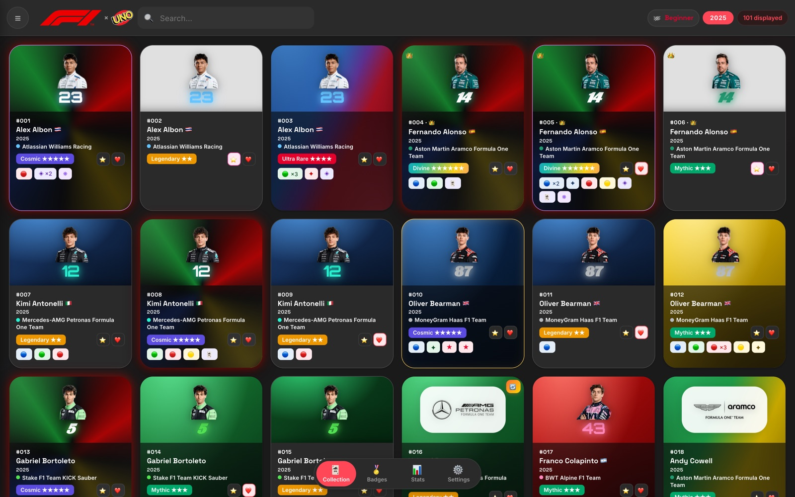
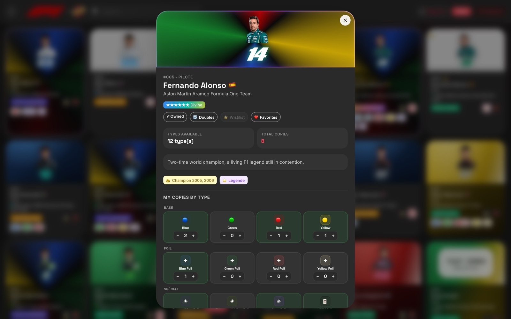
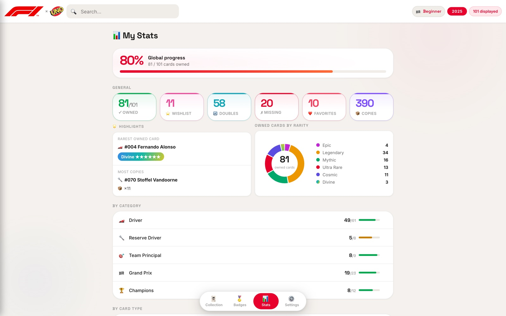

[🇬🇧 English](README.md) · [🇫🇷 Français](README.fr.md) · [🇪🇸 Español](README.es.md) · 🇨🇳 **中文** · [🇮🇹 Italiano](README.it.md) · [🇳🇱 Nederlands](README.nl.md) · [🇩🇪 Deutsch](README.de.md)

# 🏎️ F1 UNO Élite — 卡牌收藏追踪器

**一款离线优先、可安装的集换式卡牌收藏追踪应用，使用原生 JavaScript 构建，零运行时依赖——没有框架、没有 SDK、没有 CDN，也不需要后端。**

[](https://github.com/Arts44/f1-uno-elite/actions/workflows/tests.yml)


## ▶️ **[在线试用 → arts44.github.io/f1-uno-elite](https://arts44.github.io/f1-uno-elite/)**

这是一款 **PWA**：从浏览器安装后即可像原生应用一样运行，完全离线，并拥有独立图标——桌面端和移动端均可。



| 卡牌详情 — 动态闪卡效果 | 统计面板 |
|---|---|
|  |  |

<sub>更多截图见 [`screenshots/`](screenshots/) — 浅色与深色主题、桌面端与移动端。</sub>

---

## ✨ 功能一览

追踪一整套 **F1 UNO Élite** 集换式卡牌收藏——共 101 张卡牌，每张最多有 16 种变体（基础色、闪卡、双色闪、Wild、Nitro、促销卡）：

- 📇 **完整的收藏管理** — 已拥有 / 重复 / 愿望清单 / 收藏夹，支持按变体记录数量、即时搜索与多维筛选。
- ✨ **6 级动态稀有度系统** — `epic → legendary → mythic → ultra → cosmic → divine`，根据已拥有的最高变体自动计算。闪卡带有流动的光泽效果，最高等级呈现为流转的虹彩渐变（全部遵循 `prefers-reduced-motion`）。
- 📴 **完全离线可用** — 整个应用由 Service Worker 预缓存；首次访问之后，开启飞行模式也毫无影响。
- 🔄 **无感自动更新** — 后台检测新版本，轻点一下即可应用，并附带应用内更新日志，显示自*你*上次使用的版本以来有哪些变化。
- 🌍 **7 种语言** — 英语、法语、西班牙语、中文、意大利语、荷兰语、德语。涵盖每一条文本、徽章与更新日志。
- 🎓 **26 步交互式教程** — 一次引导式导览，让你*亲手执行*真实操作；教程运行在沙盒中，结束时会撤销所有改动。
- 🏅 **50 个徽章与称号** — 25 个依据可量化条件自动解锁，25 个由用户自行标记。
- 📊 **统计面板** — 总体进度、稀有度环形图、各类别完成度、亮点卡牌，以及逐日进度曲线（纯 SVG，未使用任何图表库）。
- 🔁 **多种备份方式** — JSON 导入导出、可在设备间传输的压缩备份码、同一备份码生成的可扫描二维码，以及可选的云端备份。
- 🔐 **PIN 锁、访客模式与可选加密** — 4 位 PIN 码（SHA-256）、便于分享的只读模式，以及可选的收藏静态加密（PBKDF2 + AES-GCM，密钥由 PIN 派生）。
- 🤝 **藏家工具** — 缺卡、重复卡与交换清单，可打印后带去卡牌交换会。

---

## 🛠️ 技术栈

| 领域 | 选型 |
|---|---|
| 语言 | **原生 JavaScript**（原生 ES 模块）、HTML5、CSS3 — 无框架 |
| 运行时依赖 | **零。** 运行时没有 npm 包、没有 CDN、没有 SDK |
| 构建 | [esbuild](https://esbuild.github.io/)（*唯一*的 devDependency）→ 单个压缩后的 IIFE 包 |
| 离线 / PWA | 手写 Service Worker（带版本号的预缓存、cache-first 外壳）+ Web App Manifest |
| 云端（可选） | **Supabase，使用纯 REST `fetch()`** — 无 SDK；邮箱 OTP 验证码登录，行级安全（RLS） |
| 加密 | 原生 **Web Crypto** — SHA-256（PIN）、PBKDF2 + AES-GCM（可选的静态加密） |
| 二维码 | 内置的单文件编码器（[Project Nayuki](https://www.nayuki.io/page/qr-code-generator-library)，MIT 许可） |
| 字体 | 自托管 WOFF2（SIL OFL）— 不请求 Google Fonts，提供 5 套字体主题 |
| 测试 | **Node 内置测试运行器**（`node --test`）— 166 个测试，未使用测试框架 |
| CI | GitHub Actions — 每次 push/PR 均运行测试、构建，并校验已提交产物是否为最新 |

**零运行时依赖是一条设计规则，而非偶然。** 框架或 SDK 通常提供的一切——渲染、视图切换、国际化、离线缓存、REST 认证、加密、二维码生成——都直接基于 Web 平台 API 实现。你安装的应用，就是这个仓库里的代码本身。

---

## 🧱 架构简述

源码由一组职责单一的 **ES 模块**组成，统一以 `app.js` 为入口，经 esbuild 打包为一个随仓库提交的 `app.bundle.js`（GitHub Pages 不执行任何构建步骤）。两个 HTML 入口共享其余全部代码：`index-dev.html` 直接加载原始模块用于开发，`index.html` 加载打包产物。

| 层次 | 模块 |
|---|---|
| 状态与数据 | `storage.js`（localStorage，按赛季隔离，v1→v2 迁移）、`data.js`、`history.js` |
| 界面 | `render.js`（网格、筛选、卡牌详情）、`stats.js`、`badges.js`、`pin.js`（设置） |
| 平台 | `sw.js`（预缓存）、`update.js`（更新流程）、`install.js`、`secure-store.js` |
| 可选云端 | `cloud.js`、`feedback.js`、`settings-sync.js` — 均为纯 REST |

所有用户操作都通过 `[data-action]` 上的**单一事件委托监听器**处理，而非内联事件处理函数——这也正是只读访客模式得以实现的基础：只需一个 `VIEWER_BLOCKED` 集合即可拦截全部写入操作。界面文本从不出现在代码中，而是通过 `t()` 从覆盖全部 7 种语言的词典中取用。

---

## 🧗 技术挑战

真正塑造了这套代码的问题：

### 既要离线优先，又要始终保持最新
cache-first 的 Service Worker 让应用在离线时坚如磐石——同时也极其擅长永远提供过期代码。已安装的 PWA 受影响最严重：它们可能连续数天保持打开而不发生任何导航，浏览器因此不会重新检查 Worker。
**解法：** 新 Worker 在后台下载后，刻意停留在 *waiting* 状态（不自动调用 `skipWaiting`——在运行中的应用底下替换外壳，正是破坏其状态的典型做法）。横幅提示让用户轻点一次，通过 `SKIP_WAITING` 消息将其启用；若用户忽略横幅，新版本会在下次冷启动时自然生效。已安装的 PWA 还会在每次回到前台时以及每小时调用一次 `registration.update()`。应用版本号取自最新的更新日志条目，因此发布新版本*就是*撰写更新日志。

### 在已安装的 PWA 中依然可用的邮箱登录
传统的魔法链接（magic link）登录在已安装的 PWA 中会失效：链接在默认浏览器中打开，那是另一个存储分区，会话最终落在应用之外。
**解法：** 认证以**邮箱 OTP 验证码**为主要方式，验证码直接输入应用内，因此会话每次都在正确的上下文中创建。整个 GoTrue 流程均以纯 `fetch()` 实现。

### 一个从不触碰 API 的 Service Worker
拦截全部请求的预缓存 Service Worker，会毫不犹豫地把缓存中的 API 响应返回给应用——这是一种只在生产环境才会显现的静默数据损坏缺陷。
**解法：** Worker 完全排除 Supabase 源，云端请求另外附带 `cache: 'no-store'`。

### 一次逐字节验证等价的 CSS 重构
把数百个硬编码的间距值迁移到设计令牌，而唯一的保证只是「我看着没什么变化」。
**解法：** 只做精确匹配替换，随后给出证明——将重构前后两份样式表中的每个 `var()` 都还原为像素值，再逐字节比对。后续的一轮改动为反复出现的「半档」间距命名，而不是仅仅为了刻度整齐就四舍五入 61 处声明。

### 没有服务器，却要邮件通知反馈
**解法：** `feedback` 表上的 Postgres 触发器通过 `pg_net` 调用 Resend API，整个过程都在 Supabase 内部完成。API 密钥加密存放于 Vault 中，用户提交的内容经过 HTML 转义，邮件发送失败也绝不会阻断数据写入。

### 不用浏览器，测试一个浏览器应用
坚守零依赖的承诺，意味着排除 Jest、Vitest 以及各类无头浏览器测试框架。
**解法：** 业务逻辑经过重构，可脱离浏览器独立运行，并由 **Node 内置运行器上的 166 个测试**覆盖——没有测试依赖，也不产生真实网络请求。CI 还会重新构建产物包，一旦已提交的构建产物过期即告失败。

---

## 🚀 快速上手

需要一个现代浏览器和任意静态 HTTP 服务器（`file://` 不可行——ES 模块与 JSON 的 `fetch()` 在该协议下都会被阻止）。

```bash
# 开发 — 无需构建，直接加载原生 ES 模块：
python3 -m http.server 8000
# → http://localhost:8000/index-dev.html

# 生产构建：
npm install     # 安装 esbuild，唯一的 devDependency
npm run build   # app.js → app.bundle.js（压缩 + sourcemap）
# → http://localhost:8000/  （index.html）

npm test        # 166 个测试，node --test，无需框架
```

**部署。** 本仓库可原样部署到 GitHub Pages：所有 URL 均为相对路径，因此应用在域名根路径、子路径以及 localhost 下的表现完全一致。发布流程：新增一条更新日志条目（这*就是*版本号提升）→ 提升 `SW_VERSION` → 构建 → 推送。

---

## ⚖️ 坦诚的局限

- **PIN 只是界面层的屏障，并非强安全机制。** 未启用可选加密时，收藏数据可通过 DevTools 在 `localStorage` 中直接读取。启用加密后，随手窥探会被挡住——但对于拿到设备的人来说，4 位 PIN 可以离线暴力破解。一旦忘记 PIN，已加密的本地收藏将无法恢复。
- **云端登录运行在测试邮件域名上**，速率限制较严——对个人项目足够，但不具备生产级的邮件送达能力。
- **进度历史无法回溯补齐** — 统计曲线自该功能安装当天开始记录。

---

## 📜 许可证与商标

以 **MIT 许可证**发布 — 见 [LICENSE](LICENSE)。© 2026 Arthur — [@Arts44](https://github.com/Arts44)。

> **非官方粉丝项目，非商业用途。** 「F1」与「UNO」，以及各车队和车手的标志与图片，均归其各自所有者所有。本工具与 Formula 1、Mattel 及任何车队均无从属关系，也未获得其认可或赞助。
