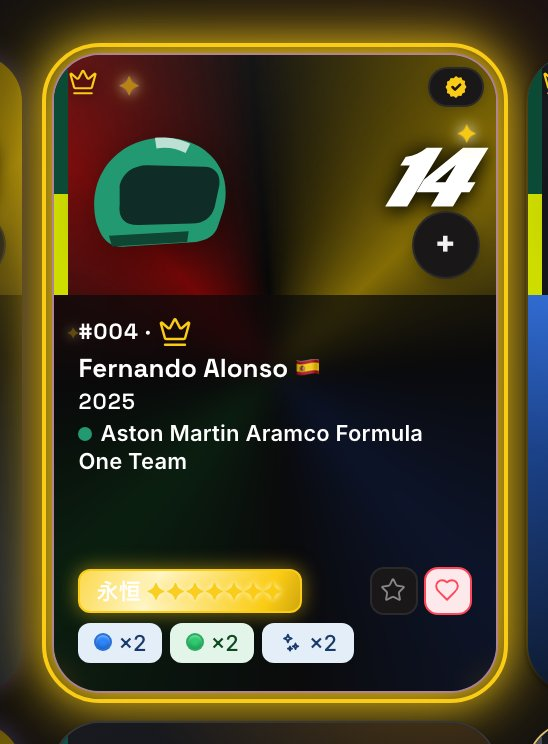
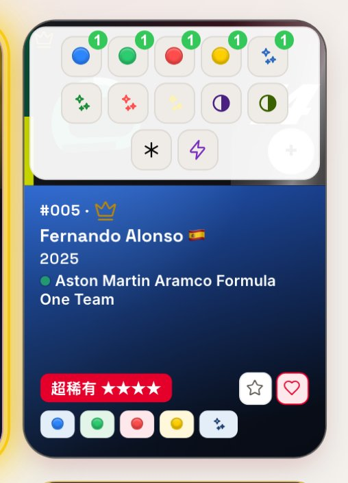
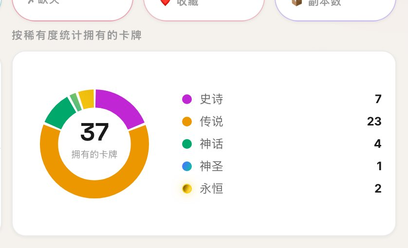
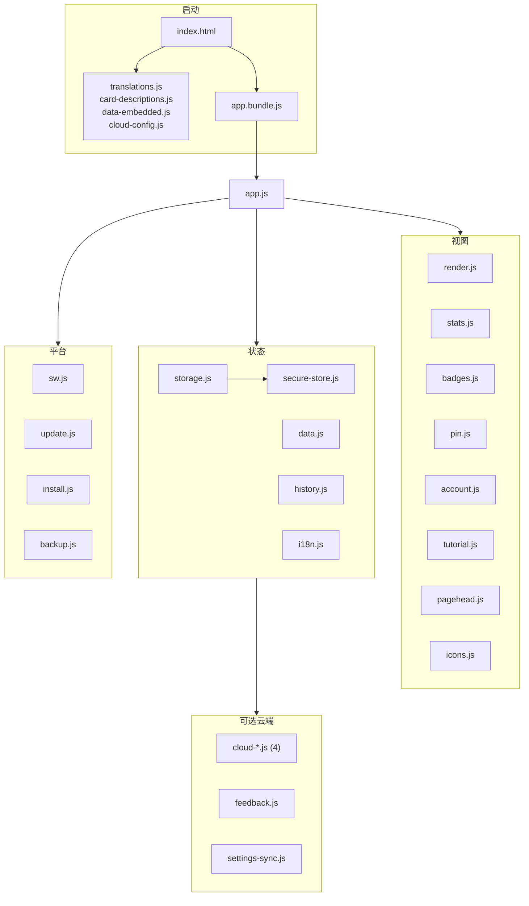

[🇬🇧 English](README.md) · [🇫🇷 Français](README.fr.md) · [🇪🇸 Español](README.es.md) · 🇨🇳 **中文** · [🇮🇹 Italiano](README.it.md) · [🇳🇱 Nederlands](README.nl.md) · [🇩🇪 Deutsch](README.de.md)

# 🏎️ F1 UNO Élite — 卡牌收藏追踪器

**一款离线优先、可安装的集换式卡牌收藏追踪应用，使用原生 JavaScript 构建，零运行时依赖——没有框架、没有 SDK、没有 CDN，也不需要后端。**

[](https://github.com/Arts44/f1-uno-elite/actions/workflows/tests.yml)


[](https://app.codacy.com/gh/Arts44/f1-uno-elite/dashboard)

## ▶️ **[在线试用 → arts44.github.io/f1-uno-elite](https://arts44.github.io/f1-uno-elite/)**

这是一款 **PWA**：从浏览器安装后即可像原生应用一样运行，完全离线，并拥有独立图标——桌面端和移动端均可。


| 卡牌详情 — 动态闪卡效果 | 统计面板 |
|---|---|
|  |  |

<sub>更多截图见 [`screenshots/`](screenshots/) — 浅色与深色主题、桌面端与移动端。</sub>

### ✨ 动态演示

| 快速添加——一次点按,一张卡 | 圆点导航 | 徽章——120 枚,七个家族 | 两个赛季，一触之遥 |
|---|---|---|---|
|  |  |  |  |

每段演示都由 `capture_demos.py` 生成，与静态截图使用同一个确定性种子；静态截图在两次运行之间**逐字节一致**——每个动画都会在拍摄前被冻结到选定的相位。GIF 为 33.3 fps；60 fps 版本在旁边：[快速添加](screenshots/demo-quick-add.mp4) · [导航](screenshots/demo-nav.mp4) · [徽章](screenshots/demo-badges.mp4) · [赛季](screenshots/demo-seasons.mp4)。


### 1.29 新功能 — v2 大改版

| 徽章 — 家族、进度、钉选目标 | 徽章详情 — 解锁日期与贡献卡牌 |
|---|---|
|  |  |

| 账户 — 云端、备份、危险区域 | 设置 — 安全卡片 |
|---|---|
|  |  |

| PIN 解锁 — 分格输入并掩码 | 邮件验证码 — 同一个共享组件 |
|---|---|
|  |  |

| 赛道轮廓 — 依据真实 GPS 轨迹重绘 | 徽章 — 浅色主题 |
|---|---|
|  |  |

| 导览 —— 五个章节,每页一章 | 五种闪卡家族,处于减弱后的强度 |
|---|---|
|  |  |


<sub>已本地化为 7 种语言 — 每一段文字、徽章和更新日志</sub>

| 永恒稀有度 — 集齐全套的冠军卡 | 快速添加 — 变体选择器 |
|---|---|
|  |  |

| 含永恒等级的稀有度环形图 | 撤销提示 |
|---|---|
|  |  |

---

## ✨ 功能一览

追踪一整套 **F1 UNO Élite** 集换式卡牌收藏——2025 赛季共 101 张卡牌，每张最多有 16 种变体（基础色、闪卡、双色闪、Wild、Nitro、促销卡）：

- 📇 **完整的收藏管理** — 已拥有 / 重复 / 愿望清单 / 收藏夹，支持按变体记录数量、整个收藏一目了然。
- ➕ **一步快速添加** — 每张卡格上的 + 按钮会打开版本选择器：点一下即可添加一张，并附“撤销”提示。页眉实时显示收藏进度（已拥有/总数）和一条细进度线。
- ✨ **7 级动态稀有度系统** — `epic → legendary → mythic → ultra → cosmic → divine → eternal`，根据已拥有的最高变体自动计算；集齐全套（拥有所有版本）再升 1 级——`eternal` 只能通过这种方式达到。闪卡带有流动的光泽效果，`divine` 呈现流转的虹彩渐变，`eternal` 则是闪耀的黑金风格（全部遵循 `prefers-reduced-motion`）。
- 📴 **完全离线可用** — 整个应用由 Service Worker 预缓存；首次访问之后，开启飞行模式也毫无影响。
- 🔄 **无感自动更新** — 后台检测新版本，轻点一下即可应用，并附带应用内更新日志，显示自*你*上次使用的版本以来有哪些变化。
- 🌍 **7 种语言** — 英语、法语、西班牙语、中文、意大利语、荷兰语、德语。涵盖每一条文本、徽章与更新日志。
- 🎓 **交互式教程：5 章共 33 步** — 每页一章，顺序与底部标签一致。一次引导之旅，你将*亲自执行*真实操作，全程运行在结束后会撤销所有改动的沙盒中。
- 🏅 **一个讲述你收藏历程的徽章页** — 120 枚徽章分为 7 个家族：收集之路、完整套组、闪卡、颜色、热爱，以及由你亲自确认的真实经历。带头衔的进度圆环、始终突出最接近解锁（或你钉选为目标）的「下一枚徽章」卡片、从 1 到 101 张的里程碑阶梯、解锁日期，以及徽章到手时真正的庆祝：合并提示、短促震动、磁贴绽放。你的收藏家卡片可导出为可分享的图片。
- 📊 **统计面板** — 总体进度、稀有度环形图、分类完成度、亮点、逐日进度曲线（纯 SVG，无图表库），以及作为内部标签页的收藏家工具：缺卡、重复卡与交换清单。
- 👤 **独立的账户页** — 通过邮件验证码登录云端、上传/恢复备份、JSON 导入导出、二维码传输、应用内反馈，以及提供三种删除范围的危险区域，每一种都需要输入指定词语才能确认。旁观模式下整页会被锁定状态取代——控件是「不存在」，而非「变灰」。
- 🔁 **多种备份方式** — JSON 导入导出、可在设备间传输的压缩备份码、同一备份码生成的可扫描二维码，以及可选的云端备份。
- 🔐 **PIN 锁、旁观模式与可选加密** — 分格键盘上的 4 位 PIN 码（每个数字短暂显示后掩码）、带可见进度的创建/修改/停用引导流程、用于分享的只读模式，以及可选的本地静态加密（PBKDF2 + AES-GCM，密钥由 PIN 派生）。
- 🧭 **带圆钮的底部导航栏** — 胶囊、凹槽与圆钮是同一条 SVG 路径，由同一个动画时钟逐帧重算，因此两者绝不脱节。可拖动、可键盘操作，并遵循 `prefers-reduced-motion`。

---

## 🛠️ 技术栈

| 领域 | 选型 |
|---|---|
| 语言 | **原生 JavaScript**（原生 ES 模块）、HTML5、CSS3 — 无框架 |
| 运行时依赖 | **零。** 运行时没有 npm 包、没有 CDN、没有 SDK |
| 构建 | [esbuild](https://esbuild.github.io/)（*唯一*的 devDependency）→ 单个压缩后的 IIFE 包 |
| 离线 / PWA | 手写 Service Worker（带版本号的预缓存、cache-first 外壳）+ Web App Manifest |
| 云端（可选） | **Supabase，使用纯 REST `fetch()`** — 无 SDK；邮箱 OTP 验证码登录，行级安全（RLS） |
| 加密 | 原生 **Web Crypto** — SHA-256（PIN）、PBKDF2 + AES-GCM（可选的静态加密） |
| 二维码 | 内置的单文件编码器（[Project Nayuki](https://www.nayuki.io/page/qr-code-generator-library)，MIT 许可） |
| 字体 | 自托管 WOFF2（SIL OFL）— 不请求 Google Fonts，提供 5 套字体主题 |
| 测试 | **Node 内置测试运行器**（`node --test`）— 866 个测试，未使用测试框架 |
| CI | GitHub Actions — 每次 push/PR 均运行测试、构建，并校验已提交产物是否为最新 |

**零运行时依赖是一条设计规则，而非偶然。** 框架或 SDK 通常提供的一切——渲染、视图切换、国际化、离线缓存、REST 认证、加密、二维码生成——都直接基于 Web 平台 API 实现。你安装的应用，就是这个仓库里的代码本身。 此后：726 行的 `cloud.js` 在 61 个从未修改的特征测试保护下拆成四个模块，由此解锁了 `pushSeason(s)` 与 `listCloudSeasons()`——已对真实 Supabase 数据库验证；两处 XSS 也已在源头（`tEsc()` 与数据入口）封堵。

---

## 🧱 架构简述

源码由一组职责单一的 **ES 模块**组成，统一以 `app.js` 为入口，经 esbuild 打包为一个随仓库提交的 `app.bundle.js`（GitHub Pages 不执行任何构建步骤）。两个 HTML 入口共享其余全部代码：`index-dev.html` 直接加载原始模块用于开发，`index.html` 加载打包产物。

| 层次 | 模块 |
|---|---|
| 状态与数据 | `storage.js`（localStorage，按赛季隔离，v1→v2 迁移）、`data.js`、`history.js` |
| 界面 | `render.js`（网格、筛选、卡牌详情）、`stats.js`、`badges.js`、`pin.js`（设置） |
| 平台 | `sw.js`（预缓存）、`update.js`（更新流程）、`install.js`、`secure-store.js` |
| 可选云端 | `cloud.js`、`feedback.js`、`settings-sync.js` — 均为纯 REST |

所有用户操作都通过 `[data-action]` 上的**单一事件委托监听器**处理，而非内联事件处理函数——这也正是只读访客模式得以实现的基础：只需一个 `VIEWER_BLOCKED` 集合即可拦截全部写入操作。界面文本从不出现在代码中，而是通过 `t()` 从覆盖全部 7 种语言的词典中取用。

### 项目的结构

四个传统脚本在模块之前发布 `window.__*` 全局变量;其余一切都是位于单一入口之后的 ES 模块。


```mermaid
flowchart TB
  subgraph BOOT["启动"]
    H["index.html"] --> C["translations.js<br/>card-descriptions.js<br/>data-embedded.js<br/>cloud-config.js"]
    H --> B["app.bundle.js"]
  end
  B --> APP["app.js"]
  APP --> UI
  APP --> ST
  APP --> PL
  subgraph UI["视图"]
    R["render.js"]; S["stats.js"]; BG["badges.js"]; PN["pin.js"]; AC["account.js"]; TU["tutorial.js"]; PH["pagehead.js"]; IC["icons.js"]
  end
  subgraph ST["状态"]
    STO["storage.js"]; DA["data.js"]; HI["history.js"]; SEC["secure-store.js"]; I18["i18n.js"]
  end
  subgraph PL["平台"]
    SW["sw.js"]; UP["update.js"]; IN["install.js"]; BK["backup.js"]
  end
  subgraph CL["可选云端"]
    CLO["cloud-*.js (4)"]; FB["feedback.js"]; SS["settings-sync.js"]
  end
  ST --> CL
  STO --> SEC
```


---

## 🧗 技术挑战

真正塑造了这套代码的问题：

### 既要离线优先，又要始终保持最新
cache-first 的 Service Worker 让应用在离线时坚如磐石——同时也极其擅长永远提供过期代码。已安装的 PWA 受影响最严重：它们可能连续数天保持打开而不发生任何导航，浏览器因此不会重新检查 Worker。
**解法：** 新 Worker 在后台下载后，刻意停留在 *waiting* 状态（不自动调用 `skipWaiting`——在运行中的应用底下替换外壳，正是破坏其状态的典型做法）。横幅提示让用户轻点一次，通过 `SKIP_WAITING` 消息将其启用；若用户忽略横幅，新版本会在下次冷启动时自然生效。已安装的 PWA 还会在每次回到前台时以及每小时调用一次 `registration.update()`。应用版本号取自最新的更新日志条目，因此发布新版本*就是*撰写更新日志。

### 在已安装的 PWA 中依然可用的邮箱登录
传统的魔法链接（magic link）登录在已安装的 PWA 中会失效：链接在默认浏览器中打开，那是另一个存储分区，会话最终落在应用之外。
**解法：** 认证以**邮箱 OTP 验证码**为主要方式，验证码直接输入应用内，因此会话每次都在正确的上下文中创建。整个 GoTrue 流程均以纯 `fetch()` 实现。

### 一个从不触碰 API 的 Service Worker
拦截全部请求的预缓存 Service Worker，会毫不犹豫地把缓存中的 API 响应返回给应用——这是一种只在生产环境才会显现的静默数据损坏缺陷。
**解法：** Worker 完全排除 Supabase 源，云端请求另外附带 `cache: 'no-store'`。

### 一次逐字节验证等价的 CSS 重构
把数百个硬编码的间距值迁移到设计令牌，而唯一的保证只是「我看着没什么变化」。
**解法：** 只做精确匹配替换，随后给出证明——将重构前后两份样式表中的每个 `var()` 都还原为像素值，再逐字节比对。后续的一轮改动为反复出现的「半档」间距命名，而不是仅仅为了刻度整齐就四舍五入 61 处声明。

### 没有服务器，却要邮件通知反馈
**解法：** `feedback` 表上的 Postgres 触发器通过 `pg_net` 调用 Resend API，整个过程都在 Supabase 内部完成。API 密钥加密存放于 Vault 中，用户提交的内容在 SQL 侧经过 HTML 转义，触发器还会吞掉自身的失败（`exception when others`）：邮件发送失败绝不会阻断数据写入。**第二个触发器在数据库里施加真正的频率限制**——每位用户每小时五条，以 `rate_limited` 抛出——应用会把该错误映射为一个具名错误码。客户端的冷却只是礼貌，真正的防护在服务端。

### 不用浏览器，测试一个浏览器应用
坚守零依赖的承诺，意味着排除 Jest、Vitest 以及各类无头浏览器测试框架。
**解法：** 业务逻辑经过重构，可脱离浏览器独立运行，并由 **Node 内置运行器上的 866 个测试**覆盖——没有测试依赖，也不产生真实网络请求。CI 还会重新构建产物包，一旦已提交的构建产物过期即告失败。

---

### 测试覆盖了什么 —— 以及没有覆盖什么

866 项测试,跑在 Node 内置的测试运行器上,不用任何框架。说清楚边界,比数字本身更重要:

- **已覆盖:**存储迁移与按赛季划分的键方案;七级稀有度阶梯,含整套收齐的升级;全部徽章条件与难度模型;收藏者清单(缺失、重复、交换);备份码的编解码往返;针对模拟 `fetch` 的云端辅助函数,含失败路径;7 种语言的 i18n 键一致性与重复键检测;以真实导入图校验的 service worker 预缓存;键盘可达性的标记契约;每一处由外部数据填充的 `innerHTML` 的来源;两种主题下手工核对的对比度。
- **未覆盖:**真实渲染(除标记字符串外没有 DOM 断言)、service worker 的运行时行为、真实网络请求、IndexedDB、安装提示,以及任何需要浏览器引擎的部分 —— 这些靠手工验证和确定性的截图流程来保证,而不是靠测试套件。上面给出的百分比只衡量这一无浏览器的部分——请照此理解，而不要当作对整个应用的衡量。

## 🚀 快速上手

需要一个现代浏览器和任意静态 HTTP 服务器（`file://` 不可行——ES 模块与 JSON 的 `fetch()` 在该协议下都会被阻止）。

```bash
# 开发 — 无需构建，直接加载原生 ES 模块：
python3 -m http.server 8000
# → http://localhost:8000/index-dev.html

# 生产构建：
npm install     # 安装 esbuild，唯一的 devDependency
npm run build   # app.js → app.bundle.js（压缩 + sourcemap）
# → http://localhost:8000/  （index.html）

npm test        # 866 个测试，node --test，无需框架
```

**部署。** 本仓库可原样部署到 GitHub Pages：所有 URL 均为相对路径，因此应用在域名根路径、子路径以及 localhost 下的表现完全一致。发布流程：新增一条更新日志条目（这*就是*版本号提升）→ 提升 `SW_VERSION` → 构建 → 推送。

---

## ⚖️ 坦诚的局限

- **PIN 只是界面层的屏障，并非强安全机制。** 未启用可选加密时，收藏数据可通过 DevTools 在 `localStorage` 中直接读取。启用加密后，随手窥探会被挡住——但对于拿到设备的人来说，4 位 PIN 可以离线暴力破解。一旦忘记 PIN，已加密的本地收藏将无法恢复。
- **反馈通知从 Resend 的测试域名发出**（`onboarding@resend.dev`）。从该域名发信时，Resend 只投递到账号所有者本人的地址：通知只会到达维护者，不会到达其他任何人。要从别处发信，就必须拥有并验证一个域名。这是有意接受的限制，而非缺陷：反馈无论如何都会写入数据库，发送失败也绝不会阻断写入。
- **登录验证码走的是在 Supabase 中配置的自建 SMTP 服务商**——与上述通知完全是两条独立链路。送达率、配额与发件人信誉取决于该服务商，本仓库并不衡量它们；请把登录邮件视为个人项目范围内的「尽力而为」。
- **进度历史无法回溯补齐** — 统计曲线自该功能安装当天开始记录。
- **Codacy 评级为 A——其四项质量目标中有一项是红的。** 基于提交 `b680aed` 测量，123 个文件、9 643 行。绿：重复率 5 %（目标 10 %），覆盖率 69 %——这一次 Codacy 的读数与本地 `npm run test:cov`（69.21 %）一致，目标为 60 %，即九个百分点的余量，而非此前的 2.7。红：复杂度，**被分析文件中有 45 % 超过阈值**，目标为 10 %——在 `cloud.js` 被拆成四个模块之后这个比例反而*上升*了，这恰恰说明了该指标的性质：它统计的是*文件*，因此由少数大模块构成的代码库会被惩罚。这是关于度量方式的事实，不是借口；`badges.js` 确实承担过多。还有一个徽章掩盖的数字：**2 个未处理问题**，此前是 11 个——截图脚本里的 8 个和 `account.js` 的 2 个未使用变量都已修复，而不是被消音（`c5941cd`）。剩下的两个是**同一条规则击中了并非机密的字符串**：`capture_seed.py` 中的假令牌（`demo.access.token`，从不发布的开发工具）和 `cloud-auth.js` 中的 `SESSION_KEY = 'f1uno_cloud_session'`——那是一个 localStorage 键的*名称*。它们被有意保留可见：一条留在面板上的误报只需一行说明，而关闭规则会把它本该抓住的真实问题一并藏起来。

---

## 🔩 工程说明

运行时零依赖(仅构建时使用 esbuild);11 px 字号下限，已在 5 种字体主题 × 2 种配色主题 × 320/375/桌面下逐一核验（仅一处例外：标志中 8 px 的「ÉLITE」，属于品牌标识）；布局偏移经过测量，现在确实为零：卡片高度已固定（此前有 13 种不同高度，从 246,69 到 292,69 px），骨架屏读取同一个 CSS 变量，因此完全吻合——代价是滚动增加 19,4 %，即处处预留最坏情况的成本;快速添加经性能剖析优化(中端手机约 300 毫秒 → 约 45 毫秒，单次测量，未在 CI 中复现);可选的本地加密与 PIN 绑定(PBKDF2 + AES-GCM);旁观者模式在逻辑层锁定而非 CSS;截图由仓库内确定性脚本重新生成，三段动画演示由脚本生成、可复现;866 个测试基于原生 JS 与 Node 内置测试运行器。完整细节见[英文 README](README.md)。

---

## ☕ 支持开发者

**设置 → 关于**里有一个对外链接，指向 [Ko-fi](https://ko-fi.com/arts44)。它支持的是**我这个开发者**，而不是这个应用，也不是它所涉及的题材。没有第三方脚本，没有追踪像素，没有任何个人数据离开设备：它就是一个 `<a target="_blank" rel="noopener noreferrer">`，仅此而已。URL 只写在一个常量里（`pin.js` 中的 `SUPPORT_URL`），清空它整行就会消失。离线时该行会明显变为不可用，而不是把人带到一个打不开的页面。

**捐赠不会解锁任何东西**——没有功能，没有徽章，名单上也不会出现名字。能买到东西的捐赠就成了购买，而这个项目始终是一个非商业的粉丝项目。

---

## 📜 许可证与商标

以 **MIT 许可证**发布 — 见 [LICENSE](LICENSE)。© 2026 Arthur — [@Arts44](https://github.com/Arts44)。

> **非官方粉丝项目，非商业用途。** 「F1」与「UNO」，以及各车队和车手的标志与图片，均归其各自所有者所有。本工具与 Formula 1、Mattel 及任何车队均无从属关系，也未获得其认可或赞助。
